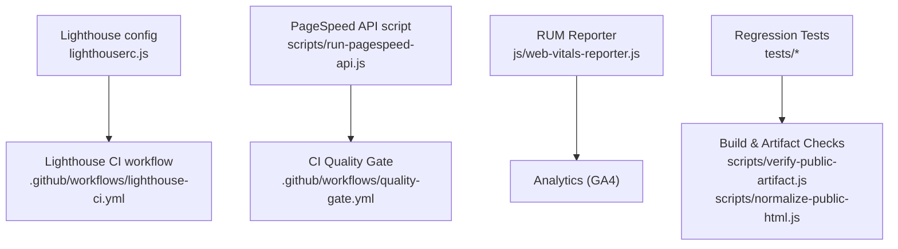
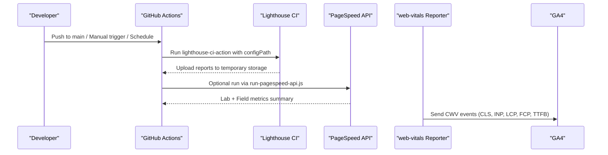
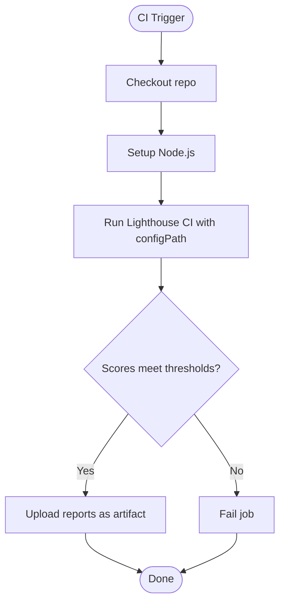
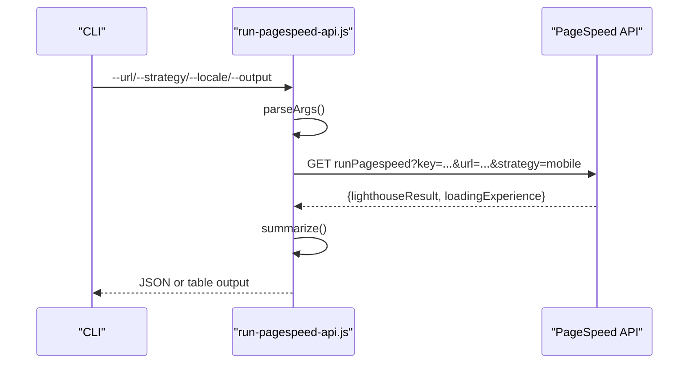
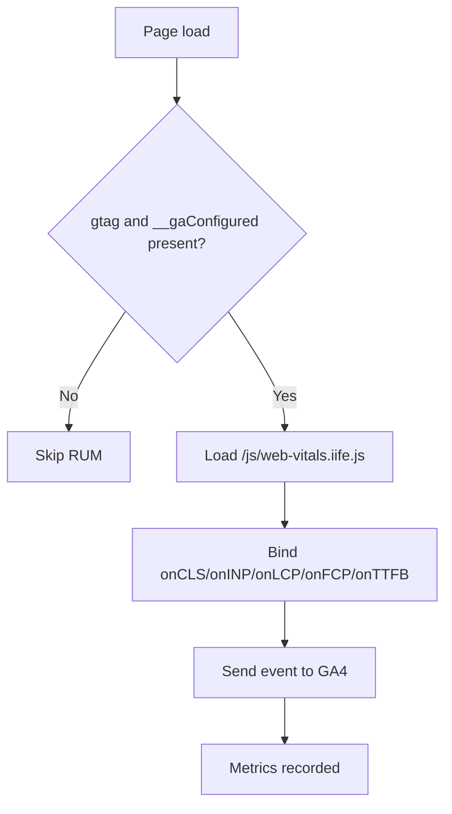
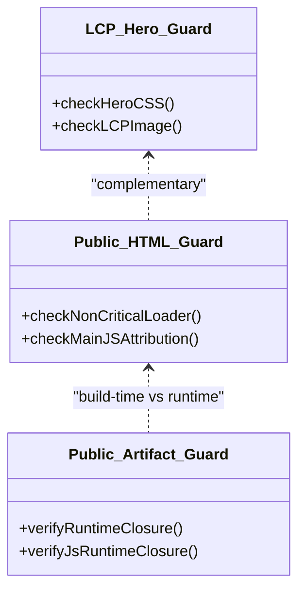
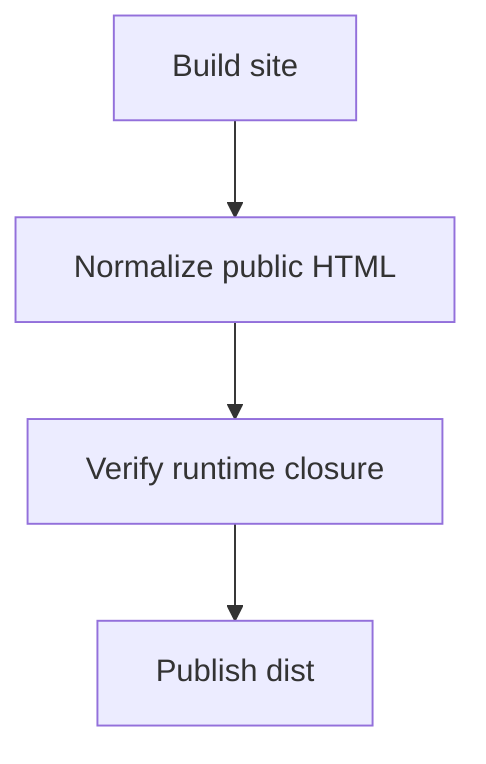
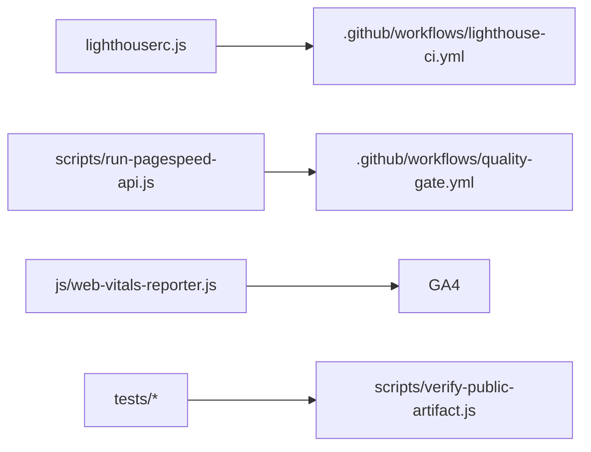

# Performance & Lighthouse Testing

<cite>
**Referenced Files in This Document**
- [lighthouserc.js](file://lighthouserc.js)
- [.github/workflows/lighthouse-ci.yml](file://.github/workflows/lighthouse-ci.yml)
- [.github/workflows/quality-gate.yml](file://.github/workflows/quality-gate.yml)
- [scripts/run-pagespeed-api.js](file://scripts/run-pagespeed-api.js)
- [js/web-vitals-reporter.js](file://js/web-vitals-reporter.js)
- [package.json](file://package.json)
- [tests/lcp-hero-regressions.test.js](file://tests/lcp-hero-regressions.test.js)
- [tests/public-html-regressions.test.js](file://tests/public-html-regressions.test.js)
- [tests/public-artifact-regressions.test.js](file://tests/public-artifact-regressions.test.js)
- [scripts/verify-public-artifact.js](file://scripts/verify-public-artifact.js)
- [scripts/normalize-public-html.js](file://scripts/normalize-public-html.js)
- [docs/PERFORMANCE-OPTIMIZATION-REPORT.md](file://docs/PERFORMANCE-OPTIMIZATION-REPORT.md)
</cite>

## Table of Contents
1. Introduction
2. Project Structure
3. Core Components
4. Architecture Overview
5. Detailed Component Analysis
6. Dependency Analysis
7. Performance Considerations
8. Troubleshooting Guide
9. Conclusion
10. Appendices

## Introduction
This document explains how WebNovis measures, enforces, and monitors performance using Lighthouse CI, the PageSpeed API, and real-user monitoring (RUM). It covers configuration, CI/CD integration with quality gates, automated regression detection for Core Web Vitals, and guidance on interpreting reports and implementing improvements.

## Project Structure
Performance-related assets are organized across:
- Lighthouse configuration and CI workflow
- PageSpeed API script for lab + field metrics
- RUM reporter for Core Web Vitals to analytics
- Regression tests guarding critical performance behaviors
- Build-time normalization and artifact verification that affect runtime performance

**Diagram sources**
- [lighthouserc.js:1-28](file://lighthouserc.js#L1-L28)
- [.github/workflows/lighthouse-ci.yml:1-27](file://.github/workflows/lighthouse-ci.yml#L1-L27)
- [scripts/run-pagespeed-api.js:1-128](file://scripts/run-pagespeed-api.js#L1-L128)
- [.github/workflows/quality-gate.yml:1-47](file://.github/workflows/quality-gate.yml#L1-L47)
- [js/web-vitals-reporter.js:1-33](file://js/web-vitals-reporter.js#L1-L33)
- [tests/lcp-hero-regressions.test.js:1-74](file://tests/lcp-hero-regressions.test.js#L1-L74)
- [scripts/verify-public-artifact.js:86-162](file://scripts/verify-public-artifact.js#L86-L162)
- [scripts/normalize-public-html.js:33-49](file://scripts/normalize-public-html.js#L33-L49)

**Section sources**
- [lighthouserc.js:1-28](file://lighthouserc.js#L1-L28)
- [.github/workflows/lighthouse-ci.yml:1-27](file://.github/workflows/lighthouse-ci.yml#L1-L27)
- [.github/workflows/quality-gate.yml:1-47](file://.github/workflows/quality-gate.yml#L1-L47)
- [scripts/run-pagespeed-api.js:1-128](file://scripts/run-pagespeed-api.js#L1-L128)
- [js/web-vitals-reporter.js:1-33](file://js/web-vitals-reporter.js#L1-L33)
- [tests/lcp-hero-regressions.test.js:1-74](file://tests/lcp-hero-regressions.test.js#L1-L74)
- [scripts/verify-public-artifact.js:86-162](file://scripts/verify-public-artifact.js#L86-L162)
- [scripts/normalize-public-html.js:33-49](file://scripts/normalize-public-html.js#L33-L49)

## Core Components
- Lighthouse CI configuration defines target URLs, number of runs, and category thresholds for performance, SEO, and accessibility. Reports are uploaded to temporary public storage.
- GitHub Actions workflow runs Lighthouse CI on pushes to main, manual triggers, and a weekly schedule, then uploads artifacts for review.
- PageSpeed API script calls Google’s PageSpeed Insights API, summarizes lab and field metrics, and supports JSON or table output.
- RUM reporter dynamically loads web-vitals and sends Core Web Vitals events to GA4 when configured and consented.
- Regression tests enforce performance-critical patterns such as LCP-friendly hero rules and progressive loading of non-critical scripts.
- Build-time checks verify runtime asset references and normalize HTML to ensure consistent performance behavior in production artifacts.

**Section sources**
- [lighthouserc.js:1-28](file://lighthouserc.js#L1-L28)
- [.github/workflows/lighthouse-ci.yml:1-27](file://.github/workflows/lighthouse-ci.yml#L1-L27)
- [scripts/run-pagespeed-api.js:1-128](file://scripts/run-pagespeed-api.js#L1-L128)
- [js/web-vitals-reporter.js:1-33](file://js/web-vitals-reporter.js#L1-L33)
- [tests/lcp-hero-regressions.test.js:1-74](file://tests/lcp-hero-regressions.test.js#L1-L74)
- [tests/public-html-regressions.test.js:1-59](file://tests/public-html-regressions.test.js#L1-L59)
- [scripts/verify-public-artifact.js:86-162](file://scripts/verify-public-artifact.js#L86-L162)
- [scripts/normalize-public-html.js:33-49](file://scripts/normalize-public-html.js#L33-L49)

## Architecture Overview
The performance pipeline combines lab testing (Lighthouse), field data (PageSpeed Insights), and real-user telemetry (web-vitals to GA4), enforced by CI quality gates and regression tests.

**Diagram sources**
- [.github/workflows/lighthouse-ci.yml:1-27](file://.github/workflows/lighthouse-ci.yml#L1-L27)
- [lighthouserc.js:1-28](file://lighthouserc.js#L1-L28)
- [scripts/run-pagespeed-api.js:1-128](file://scripts/run-pagespeed-api.js#L1-L128)
- [js/web-vitals-reporter.js:1-33](file://js/web-vitals-reporter.js#L1-L33)

## Detailed Component Analysis

### Lighthouse Configuration and CI
- Targets multiple key pages and runs three iterations per URL to stabilize scores.
- Enforces minimum category scores: performance, SEO, accessibility.
- Workflow runs on push to main, manual dispatch, and weekly schedule; artifacts are retained for 30 days.

**Diagram sources**
- [.github/workflows/lighthouse-ci.yml:1-27](file://.github/workflows/lighthouse-ci.yml#L1-L27)
- [lighthouserc.js:1-28](file://lighthouserc.js#L1-L28)

**Section sources**
- [lighthouserc.js:1-28](file://lighthouserc.js#L1-L28)
- [.github/workflows/lighthouse-ci.yml:1-27](file://.github/workflows/lighthouse-ci.yml#L1-L27)

### PageSpeed API Integration
- Reads CLI options for URL, strategy, locale, and output format.
- Resolves API key from environment variables and calls the PageSpeed Insights endpoint.
- Summarizes lab metrics (FCP, LCP, Speed Index, TBT, CLS) and field percentiles (FCP, LCP, CLS, INP).
- Outputs either JSON or a human-readable table.

**Diagram sources**
- [scripts/run-pagespeed-api.js:1-128](file://scripts/run-pagespeed-api.js#L1-L128)

**Section sources**
- [scripts/run-pagespeed-api.js:1-128](file://scripts/run-pagespeed-api.js#L1-L128)

### Real User Monitoring (Core Web Vitals to GA4)
- Loads web-vitals IIFE only when GA4 is configured and consent is granted.
- Sends CLS, INP, LCP, FCP, and TTFB events with metric value and rating.

**Diagram sources**
- [js/web-vitals-reporter.js:1-33](file://js/web-vitals-reporter.js#L1-L33)

**Section sources**
- [js/web-vitals-reporter.js:1-33](file://js/web-vitals-reporter.js#L1-L33)

### Performance Regression Guards
- LCP hero guard ensures CSS does not delay hero visibility and that the LCP image uses high priority.
- Public HTML guard verifies progressive loading of non-critical scripts and presence of attribution attributes in analytics code.
- Public artifact guard validates runtime dependency closures for JS and HTML/CSS references to prevent missing assets at runtime.

**Diagram sources**
- [tests/lcp-hero-regressions.test.js:1-74](file://tests/lcp-hero-regressions.test.js#L1-L74)
- [tests/public-html-regressions.test.js:1-59](file://tests/public-html-regressions.test.js#L1-L59)
- [scripts/verify-public-artifact.js:86-162](file://scripts/verify-public-artifact.js#L86-L162)

**Section sources**
- [tests/lcp-hero-regressions.test.js:1-74](file://tests/lcp-hero-regressions.test.js#L1-L74)
- [tests/public-html-regressions.test.js:1-59](file://tests/public-html-regressions.test.js#L1-L59)
- [tests/public-artifact-regressions.test.js:35-49](file://tests/public-artifact-regressions.test.js#L35-L49)
- [scripts/verify-public-artifact.js:86-162](file://scripts/verify-public-artifact.js#L86-L162)

### Build-Time Normalization and Asset Integrity
- Normalizer removes duplicate or legacy script tags and ensures correct inclusion of the noncritical loader and web-vitals reporter.
- Verifier scans published artifacts to detect missing runtime dependencies referenced by HTML/CSS/JS.

**Diagram sources**
- [scripts/normalize-public-html.js:33-49](file://scripts/normalize-public-html.js#L33-L49)
- [scripts/verify-public-artifact.js:86-162](file://scripts/verify-public-artifact.js#L86-L162)

**Section sources**
- [scripts/normalize-public-html.js:33-49](file://scripts/normalize-public-html.js#L33-L49)
- [scripts/verify-public-artifact.js:86-162](file://scripts/verify-public-artifact.js#L86-L162)

## Dependency Analysis
- Lighthouse CI depends on the local config file and runs against live URLs.
- PageSpeed API script depends on environment keys and external API availability.
- RUM reporter depends on GA4 initialization and the web-vitals IIFE bundle.
- Regression tests depend on built artifacts and source files to assert performance-critical patterns.

**Diagram sources**
- [lighthouserc.js:1-28](file://lighthouserc.js#L1-L28)
- [.github/workflows/lighthouse-ci.yml:1-27](file://.github/workflows/lighthouse-ci.yml#L1-L27)
- [scripts/run-pagespeed-api.js:1-128](file://scripts/run-pagespeed-api.js#L1-L128)
- [.github/workflows/quality-gate.yml:1-47](file://.github/workflows/quality-gate.yml#L1-L47)
- [js/web-vitals-reporter.js:1-33](file://js/web-vitals-reporter.js#L1-L33)
- [scripts/verify-public-artifact.js:86-162](file://scripts/verify-public-artifact.js#L86-L162)

**Section sources**
- [package.json:1-92](file://package.json#L1-L92)
- [.github/workflows/quality-gate.yml:1-47](file://.github/workflows/quality-gate.yml#L1-L47)

## Performance Considerations
- Critical rendering path: Move third-party scripts out of the head to avoid parser blocking and improve FCP.
- Resource hints: Use dns-prefetch and preconnect judiciously for third-party domains; preload only truly critical assets.
- CSS loading: Defer non-critical stylesheets to reduce render-blocking time.
- Compression: Enable server-side compression for text responses to reduce transfer size.
- DOM depth: Keep DOM size and depth reasonable to minimize memory usage and query costs.
- Progressive enhancement: Use the noncritical loader to defer heavy UI scripts until idle or user intent.

These recommendations are documented in the project’s performance optimization report and reflected in build-time normalizations and runtime loaders.

**Section sources**
- [docs/PERFORMANCE-OPTIMIZATION-REPORT.md:1-200](file://docs/PERFORMANCE-OPTIMIZATION-REPORT.md#L1-L200)
- [scripts/normalize-public-html.js:33-49](file://scripts/normalize-public-html.js#L33-L49)
- [tests/public-html-regressions.test.js:1-59](file://tests/public-html-regressions.test.js#L1-L59)

## Troubleshooting Guide
- Missing PageSpeed API key: The script requires an environment variable for the API key; without it, execution fails with a clear error message.
- Lighthouse CI failures: Jobs fail if category scores fall below configured thresholds; review reports in artifacts to identify regressions.
- Runtime asset missing: The artifact verifier detects missing JS/CSS references; fix build outputs or adjust dynamic references.
- Hero LCP issues: If LCP is not detected on mobile, ensure hero elements do not start hidden and that the LCP image has high priority.

**Section sources**
- [scripts/run-pagespeed-api.js:23-30](file://scripts/run-pagespeed-api.js#L23-L30)
- [scripts/run-pagespeed-api.js:70-96](file://scripts/run-pagespeed-api.js#L70-L96)
- [.github/workflows/lighthouse-ci.yml:16-26](file://.github/workflows/lighthouse-ci.yml#L16-L26)
- [scripts/verify-public-artifact.js:108-162](file://scripts/verify-public-artifact.js#L108-L162)
- [tests/lcp-hero-regressions.test.js:18-68](file://tests/lcp-hero-regressions.test.js#L18-L68)

## Conclusion
WebNovis integrates Lighthouse CI, PageSpeed API, and real-user monitoring to continuously measure and enforce performance. Quality gates and regression tests protect Core Web Vitals and critical rendering paths. By following the optimization guidelines and leveraging the provided scripts and workflows, teams can detect regressions early, interpret reports effectively, and implement targeted improvements.

## Appendices

### CI/CD Integration Summary
- Lighthouse CI runs on push to main, manual trigger, and weekly schedule; artifacts are uploaded for 30 days.
- Quality gate builds the site, runs regressions, and verifies production headers on relevant events.

**Section sources**
- [.github/workflows/lighthouse-ci.yml:1-27](file://.github/workflows/lighthouse-ci.yml#L1-L27)
- [.github/workflows/quality-gate.yml:1-47](file://.github/workflows/quality-gate.yml#L1-L47)

### Interpreting Reports and Identifying Bottlenecks
- Focus on LCP, INP, CLS, and FCP from both lab and field data.
- Use Lighthouse reports to pinpoint render-blocking resources, oversized images, and inefficient JavaScript.
- Cross-reference PageSpeed Insights field data to validate real-world performance.

[No sources needed since this section provides general guidance]

### Performance Budgeting and Optimization Targets
- Define budgets for total page weight, JavaScript, CSS, and images.
- Set targets aligned with Core Web Vitals thresholds and business goals.
- Enforce budgets via CI checks and regular audits.

[No sources needed since this section provides general guidance]

### Load Testing, Memory Leak Detection, and Bundle Size Analysis
- For load testing, integrate a dedicated tool into CI to simulate concurrent users and measure throughput and latency.
- For memory leak detection, use browser dev tools and Node.js heap profiling during long-running tasks.
- For bundle size analysis, track minified sizes and dependencies; alert on growth beyond thresholds.

[No sources needed since this section provides general guidance]