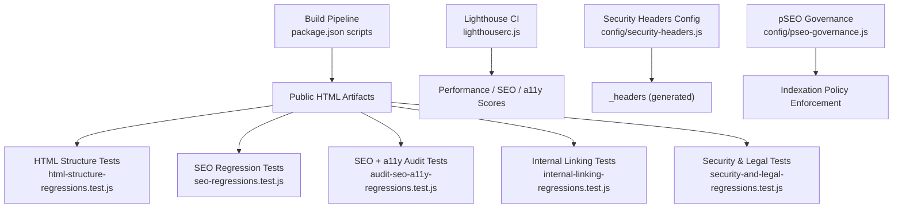
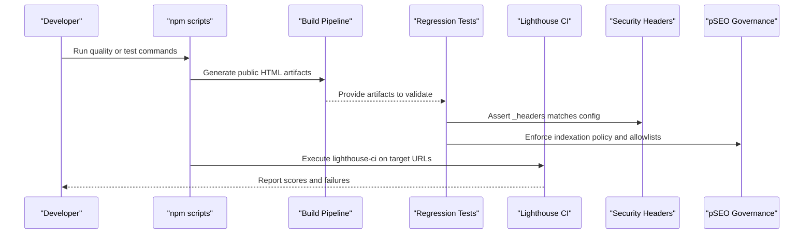
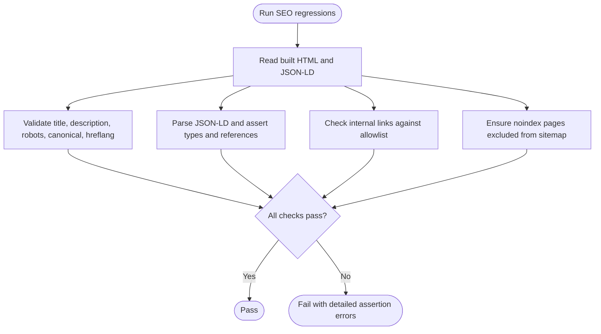
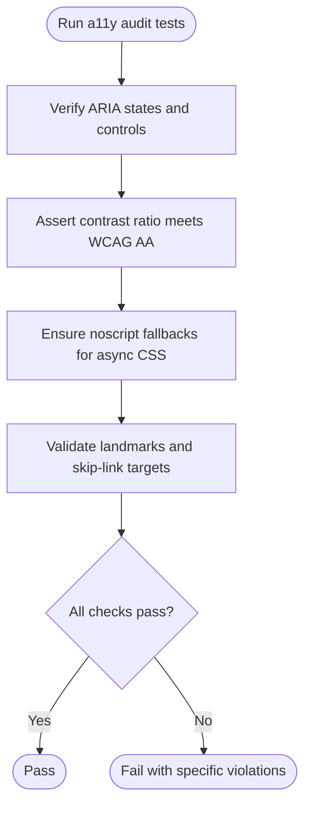
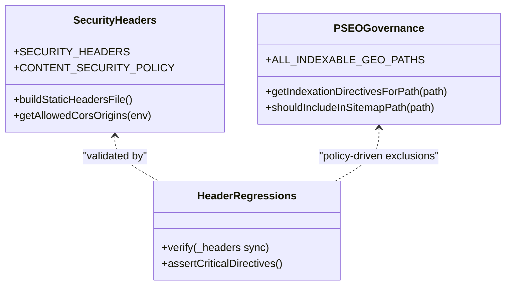
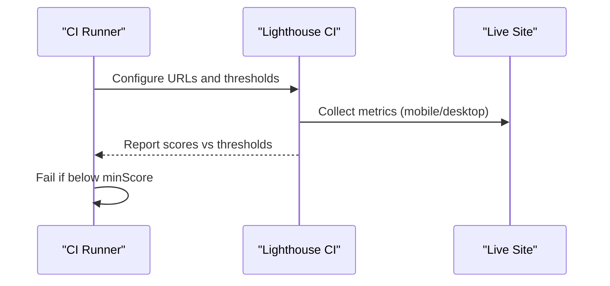
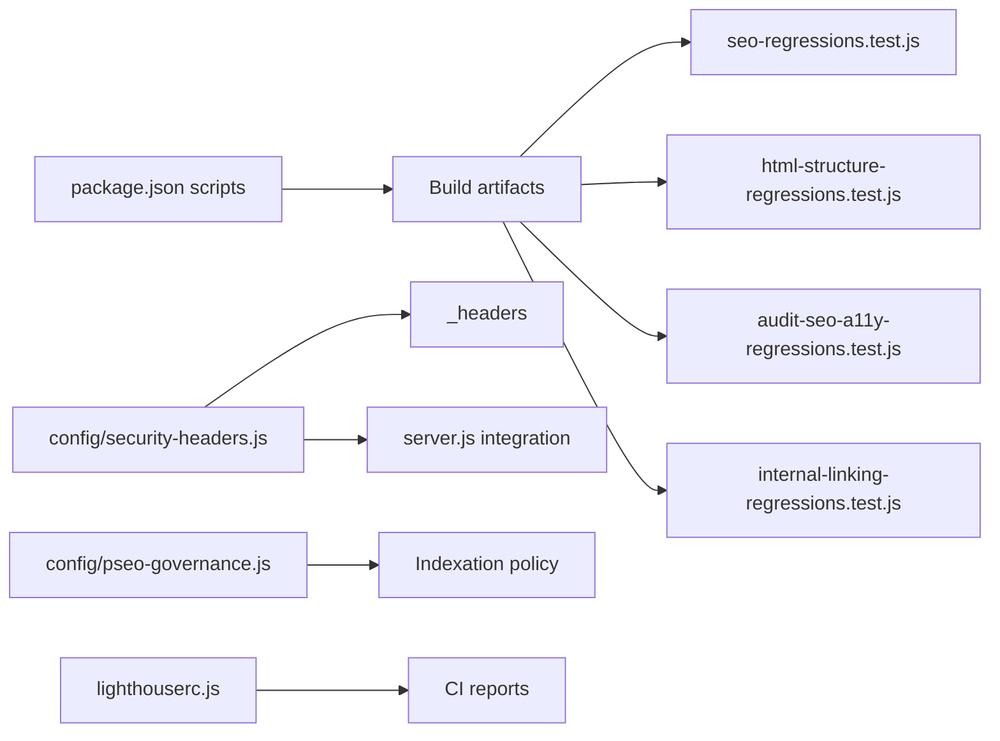

# SEO & Accessibility Testing

<cite>
**Referenced Files in This Document**
- [README.md](file://README.md)
- [package.json](file://package.json)
- [lighthouserc.js](file://lighthouserc.js)
- [tests/audit-seo-a11y-regressions.test.js](file://tests/audit-seo-a11y-regressions.test.js)
- [tests/seo-regressions.test.js](file://tests/seo-regressions.test.js)
- [tests/html-structure-regressions.test.js](file://tests/html-structure-regressions.test.js)
- [tests/internal-linking-regressions.test.js](file://tests/internal-linking-regressions.test.js)
- [tests/security-and-legal-regressions.test.js](file://tests/security-and-legal-regressions.test.js)
- [tests/security-header-regressions.test.js](file://tests/security-header-regressions.test.js)
- [tests/pseo-governance-regressions.test.js](file://tests/pseo-governance-regressions.test.js)
- [config/security-headers.js](file://config/security-headers.js)
- [config/pseo-governance.js](file://config/pseo-governance.js)
- [scripts/geo/head-meta.js](file://scripts/geo/head-meta.js)
</cite>

## Table of Contents
1. Introduction
2. Project Structure
3. Core Components
4. Architecture Overview
5. Detailed Component Analysis
6. Dependency Analysis
7. Performance Considerations
8. Troubleshooting Guide
9. Conclusion

## Introduction
This document explains how the WebNovis project automates SEO and accessibility testing across builds, artifacts, and production-like checks. It covers:
- Automated SEO audits for meta tags, schema markup, internal linking structure, and search engine optimization compliance.
- Accessibility testing techniques to validate WCAG-aligned behavior, keyboard navigation, screen reader compatibility, and inclusive design practices.
- Regression tests that detect broken links, missing alt texts, improper heading structures, and governance violations.
- Governance checks for privacy/legal pages, security headers, and indexation policy enforcement.
- Cross-browser and mobile considerations via Lighthouse CI assertions and progressive enhancement safeguards.
- Integration guidance into development workflows and common issue remediation.

## Project Structure
The testing strategy is implemented as a set of Node-based regression tests, Lighthouse CI configuration, and shared configuration modules. The build pipeline produces public HTML artifacts that are validated by structural and SEO/a11y checks. Security and legal policies are centralized and enforced through generated header files and server integration.

**Diagram sources**
- [package.json:6-60](file://package.json#L6-L60)
- [lighthouserc.js:1-28](file://lighthouserc.js#L1-L28)
- [tests/html-structure-regressions.test.js:37-118](file://tests/html-structure-regressions.test.js#L37-L118)
- [tests/seo-regressions.test.js:82-484](file://tests/seo-regressions.test.js#L82-L484)
- [tests/audit-seo-a11y-regressions.test.js:13-173](file://tests/audit-seo-a11y-regressions.test.js#L13-L173)
- [tests/internal-linking-regressions.test.js:32-263](file://tests/internal-linking-regressions.test.js#L32-L263)
- [tests/security-and-legal-regressions.test.js:33-115](file://tests/security-and-legal-regressions.test.js#L33-L115)
- [config/security-headers.js:40-100](file://config/security-headers.js#L40-L100)
- [config/pseo-governance.js:279-287](file://config/pseo-governance.js#L279-L287)

**Section sources**
- [package.json:6-60](file://package.json#L6-L60)
- [lighthouserc.js:1-28](file://lighthouserc.js#L1-L28)

## Core Components
- Lighthouse CI configuration asserts minimum scores for performance, SEO, and accessibility on key URLs.
- SEO regression tests validate titles, meta descriptions, JSON-LD schemas, canonical/hreflang usage, sitemap correctness, FAQ visibility vs schema alignment, and content claims.
- HTML structure tests enforce doctype, single head/body, required head elements, skip-link targets, and idempotent global transforms.
- SEO + a11y audit tests check for inline tracking snippets, script loading patterns, FAQ button state and controls, noscript fallbacks for async styles, contrast ratios, and social image dimensions.
- Internal linking tests enforce an allowlist of indexable GEO paths, prevent promotion of de-amplified pages, validate link graphs, and ensure editorial inlinks and hub clusters.
- Security and legal tests verify server integration with shared security headers, legal page landmarks, structured data presence, and absence of unverified rating badges.
- Security header tests assert synchronization between the shared config and the committed _headers file and validate critical directives.
- pSEO governance tests codify indexation directives per path, exclude de-amplified pages from sitemaps, and validate schema provider references and service URL integrity.

**Section sources**
- [lighthouserc.js:1-28](file://lighthouserc.js#L1-L28)
- [tests/seo-regressions.test.js:82-484](file://tests/seo-regressions.test.js#L82-L484)
- [tests/html-structure-regressions.test.js:37-118](file://tests/html-structure-regressions.test.js#L37-L118)
- [tests/audit-seo-a11y-regressions.test.js:13-173](file://tests/audit-seo-a11y-regressions.test.js#L13-L173)
- [tests/internal-linking-regressions.test.js:32-263](file://tests/internal-linking-regressions.test.js#L32-L263)
- [tests/security-and-legal-regressions.test.js:33-115](file://tests/security-and-legal-regressions.test.js#L33-L115)
- [tests/security-header-regressions.test.js:16-65](file://tests/security-header-regressions.test.js#L16-L65)
- [tests/pseo-governance-regressions.test.js:85-358](file://tests/pseo-governance-regressions.test.js#L85-L358)

## Architecture Overview
The testing architecture combines static artifact validation with runtime policy enforcement:
- Build outputs are parsed and asserted against SEO and a11y rules.
- Governance modules define deterministic indexation policies and allowlists.
- Security headers are centrally defined and regenerated into platform-specific files.
- Lighthouse CI runs against live URLs to measure real-world performance, SEO, and accessibility.

**Diagram sources**
- [package.json:42-47](file://package.json#L42-L47)
- [lighthouserc.js:1-28](file://lighthouserc.js#L1-L28)
- [tests/security-header-regressions.test.js:16-65](file://tests/security-header-regressions.test.js#L16-L65)
- [config/security-headers.js:40-100](file://config/security-headers.js#L40-L100)
- [config/pseo-governance.js:279-287](file://config/pseo-governance.js#L279-L287)

## Detailed Component Analysis

### Automated SEO Audit Testing
- Meta tags and social cards: Assertions enforce presence and correctness of title, description, robots, canonical, hreflang, and Open Graph/Twitter metadata where applicable.
- Schema markup: JSON-LD parsing validates Organization, Service, FAQPage, and other types; ensures provider references point to the canonical entity and avoids unverified claims like opening hours or ratings.
- Internal linking: Validates approved GEO allowlist, prevents promotion of de-amplified pages, and enforces hub-to-hub and article-to-service clusters.
- Sitemap and robots: Ensures noindex pages are excluded from sitemaps and that llms.txt does not promote non-indexable pages.

**Diagram sources**
- [tests/seo-regressions.test.js:82-484](file://tests/seo-regressions.test.js#L82-L484)
- [tests/internal-linking-regressions.test.js:32-263](file://tests/internal-linking-regressions.test.js#L32-L263)
- [tests/pseo-governance-regressions.test.js:85-358](file://tests/pseo-governance-regressions.test.js#L85-L358)

**Section sources**
- [tests/seo-regressions.test.js:82-484](file://tests/seo-regressions.test.js#L82-L484)
- [tests/internal-linking-regressions.test.js:32-263](file://tests/internal-linking-regressions.test.js#L32-L263)
- [tests/pseo-governance-regressions.test.js:85-358](file://tests/pseo-governance-regressions.test.js#L85-L358)

### Accessibility Testing Techniques
- Keyboard navigation and focus management: Checks for FAQ buttons with proper state attributes and linked panels, skip-link targets, and form grouping with fieldset/legend.
- Screen reader compatibility: Enforces semantic headings hierarchy, accessible labels for inputs, and consistent landmark structure.
- Visual accessibility: Validates color contrast for text variables against background colors and ensures async styles have noscript fallbacks.
- Progressive enhancement: Ensures deferred script loading and safe fallbacks when JavaScript is disabled.

**Diagram sources**
- [tests/audit-seo-a11y-regressions.test.js:13-173](file://tests/audit-seo-a11y-regressions.test.js#L13-L173)
- [tests/html-structure-regressions.test.js:37-118](file://tests/html-structure-regressions.test.js#L37-L118)

**Section sources**
- [tests/audit-seo-a11y-regressions.test.js:13-173](file://tests/audit-seo-a11y-regressions.test.js#L13-L173)
- [tests/html-structure-regressions.test.js:37-118](file://tests/html-structure-regressions.test.js#L37-L118)

### Governance Testing for Privacy, Legal, and Security
- Legal pages: Ensure main landmark targets exist for skip links and include appropriate structured data.
- Security headers: Centralized policy generates platform-specific headers and is verified at build time; server must import and apply shared headers.
- Indexation policy: Deterministic allowlist governs which GEO pages are indexable and included in sitemaps; de-amplified pages are excluded.

**Diagram sources**
- [config/security-headers.js:40-100](file://config/security-headers.js#L40-L100)
- [tests/security-header-regressions.test.js:16-65](file://tests/security-header-regressions.test.js#L16-L65)
- [tests/security-and-legal-regressions.test.js:33-115](file://tests/security-and-legal-regressions.test.js#L33-L115)
- [config/pseo-governance.js:279-287](file://config/pseo-governance.js#L279-L287)

**Section sources**
- [tests/security-and-legal-regressions.test.js:33-115](file://tests/security-and-legal-regressions.test.js#L33-L115)
- [tests/security-header-regressions.test.js:16-65](file://tests/security-header-regressions.test.js#L16-L65)
- [config/security-headers.js:40-100](file://config/security-headers.js#L40-L100)
- [config/pseo-governance.js:279-287](file://config/pseo-governance.js#L279-L287)

### Cross-Browser Compatibility, Mobile Responsiveness, and Progressive Enhancement
- Lighthouse CI runs multiple runs across key URLs and asserts thresholds for performance, SEO, and accessibility, providing cross-browser insights via Chrome’s rendering engine.
- Progressive enhancement is validated by ensuring async styles have noscript fallbacks and scripts are deferred to avoid blocking initial render.
- Mobile responsiveness is implicitly covered by Lighthouse’s mobile metrics and by ensuring responsive assets and fonts load correctly without blocking.

**Diagram sources**
- [lighthouserc.js:1-28](file://lighthouserc.js#L1-L28)
- [tests/audit-seo-a11y-regressions.test.js:59-80](file://tests/audit-seo-a11y-regressions.test.js#L59-L80)

**Section sources**
- [lighthouserc.js:1-28](file://lighthouserc.js#L1-L28)
- [tests/audit-seo-a11y-regressions.test.js:59-80](file://tests/audit-seo-a11y-regressions.test.js#L59-L80)

## Dependency Analysis
Key dependencies among components:
- Tests depend on built artifacts and shared configs.
- Security headers config drives both server middleware and generated _headers file.
- pSEO governance module defines deterministic indexation rules consumed by tests and build-time logic.
- Lighthouse CI depends on configured URLs and thresholds.

**Diagram sources**
- [package.json:6-60](file://package.json#L6-L60)
- [config/security-headers.js:40-100](file://config/security-headers.js#L40-L100)
- [config/pseo-governance.js:279-287](file://config/pseo-governance.js#L279-L287)
- [lighthouserc.js:1-28](file://lighthouserc.js#L1-L28)

**Section sources**
- [package.json:6-60](file://package.json#L6-L60)
- [config/security-headers.js:40-100](file://config/security-headers.js#L40-L100)
- [config/pseo-governance.js:279-287](file://config/pseo-governance.js#L279-L287)
- [lighthouserc.js:1-28](file://lighthouserc.js#L1-L28)

## Performance Considerations
- Lighthouse CI thresholds ensure performance, SEO, and accessibility meet baseline standards.
- Deferred scripts and noscript fallbacks reduce render-blocking resources and improve perceived performance.
- Centralized security headers and caching rules optimize delivery while maintaining safety.

[No sources needed since this section provides general guidance]

## Troubleshooting Guide
Common issues identified by automated tests and how to address them:
- Inline tracking snippets present in HTML: Move analytics to consent-gated loaders and remove inline snippets from templates.
- Missing or incorrect ARIA attributes on interactive components: Add aria-expanded, aria-controls, and ensure referenced IDs exist.
- Async styles without noscript fallbacks: Wrap async stylesheet links in noscript blocks to maintain styling without JS.
- Incorrect contrast ratios: Adjust CSS variables to meet WCAG AA contrast requirements against the site background.
- Broken internal links or UTM variants in crawlable links: Replace with canonical paths and use data attributes for attribution instead of query parameters.
- De-amplified GEO pages promoted in hubs: Remove direct city landing links and consolidate to approved hubs.
- Sitemap includes noindex pages: Update governance allowlist and regenerate sitemaps accordingly.
- Security headers mismatch: Regenerate _headers using the provided script and ensure server applies shared headers.

**Section sources**
- [tests/audit-seo-a11y-regressions.test.js:13-173](file://tests/audit-seo-a11y-regressions.test.js#L13-L173)
- [tests/internal-linking-regressions.test.js:32-263](file://tests/internal-linking-regressions.test.js#L32-L263)
- [tests/security-header-regressions.test.js:16-65](file://tests/security-header-regressions.test.js#L16-L65)
- [tests/pseo-governance-regressions.test.js:85-358](file://tests/pseo-governance-regressions.test.js#L85-L358)

## Conclusion
WebNovis implements a comprehensive, code-backed testing strategy for SEO and accessibility. Automated regression tests enforce meta tag correctness, schema integrity, internal linking governance, and WCAG-aligned behaviors. Security and legal compliance are enforced via centralized header policies and legal page validations. Lighthouse CI provides continuous performance and quality signals. Integrating these checks into the development workflow ensures consistent quality, reduces risk, and supports long-term SEO and accessibility goals.

[No sources needed since this section summarizes without analyzing specific files]