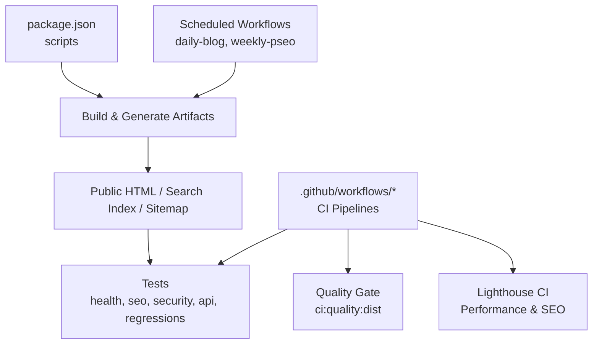
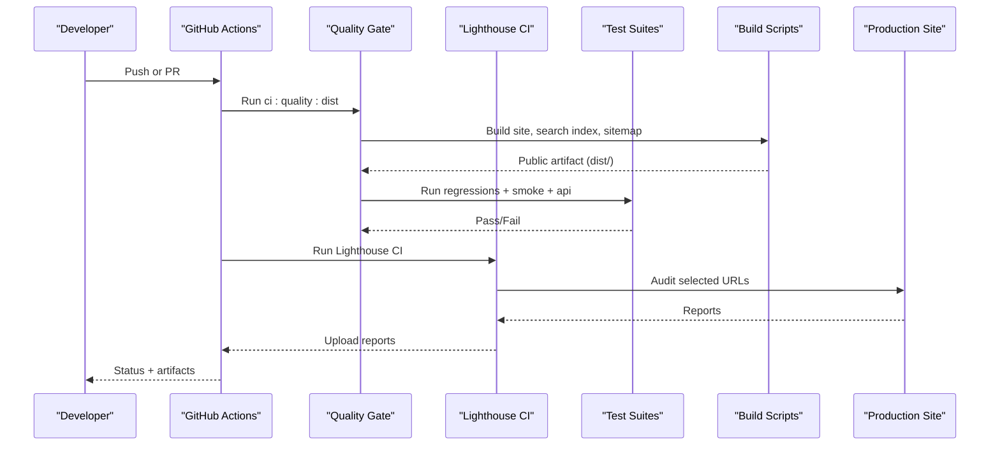
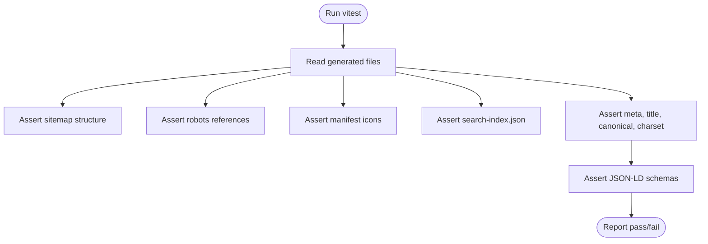
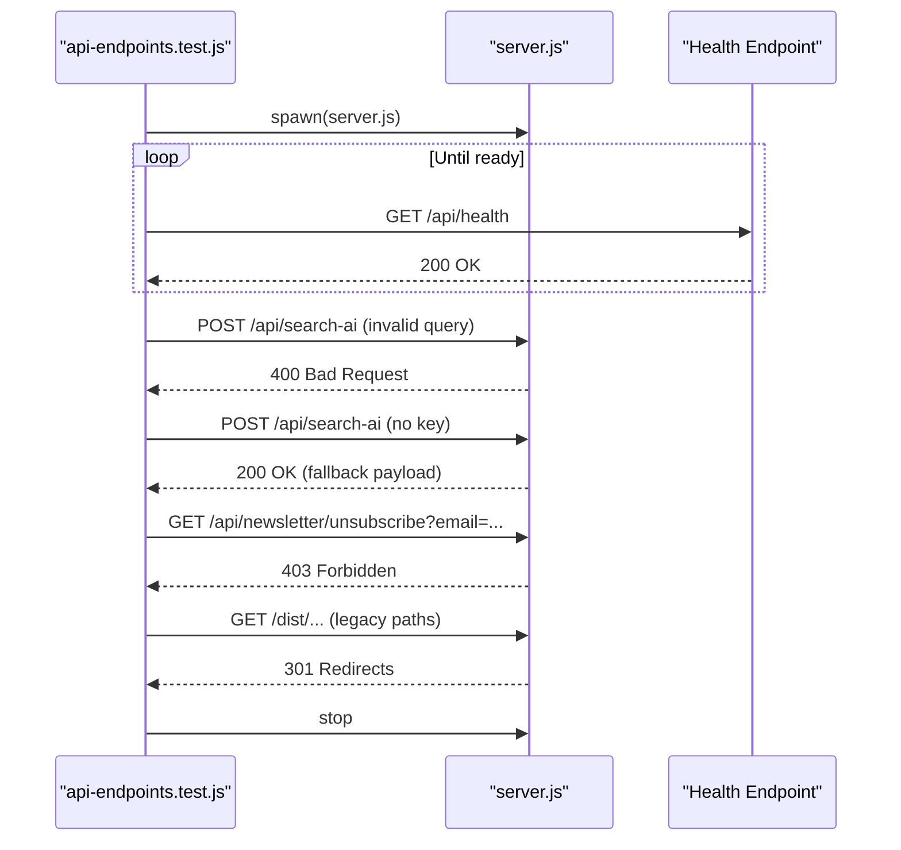
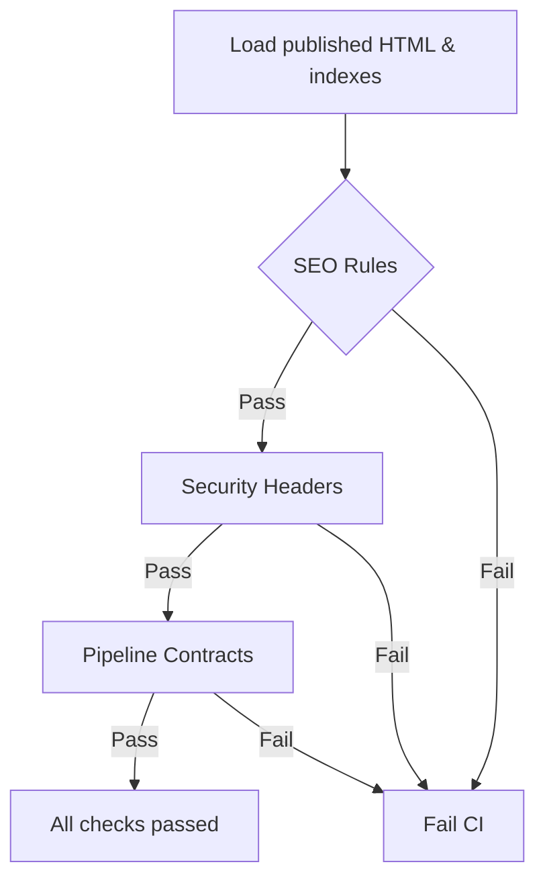
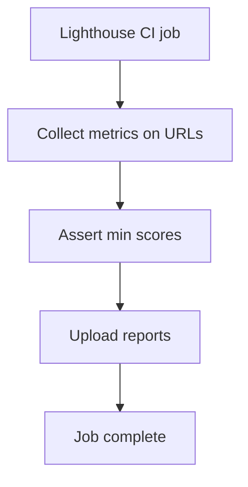
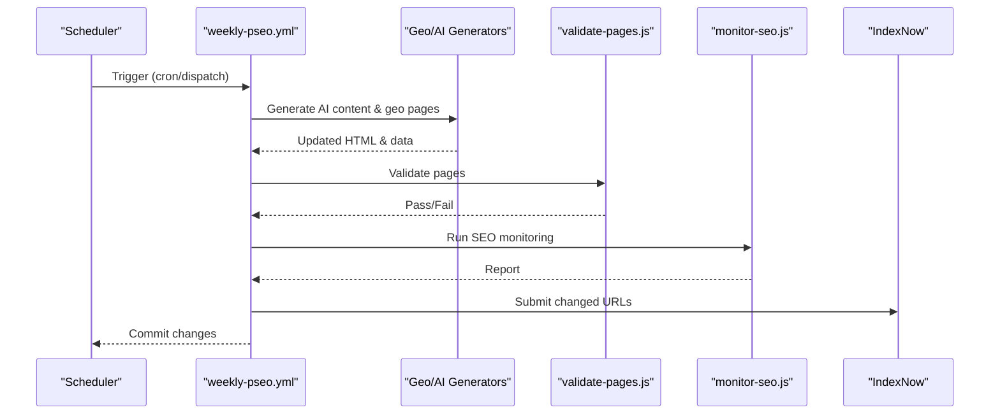
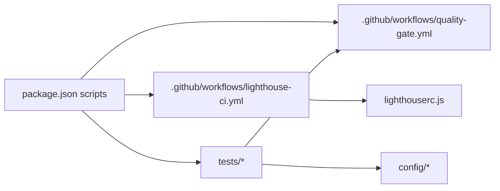

# Testing Strategy & Quality Assurance

<cite>
**Referenced Files in This Document**
- [package.json](file://package.json)
- [lighthouserc.js](file://lighthouserc.js)
- [.github/workflows/quality-gate.yml](file://.github/workflows/quality-gate.yml)
- [.github/workflows/lighthouse-ci.yml](file://.github/workflows/lighthouse-ci.yml)
- [.github/workflows/daily-blog.yml](file://.github/workflows/daily-blog.yml)
- [.github/workflows/weekly-pseo.yml](file://.github/workflows/weekly-pseo.yml)
- [tests/health.test.js](file://tests/health.test.js)
- [tests/api-endpoints.test.js](file://tests/api-endpoints.test.js)
- [tests/build-pipeline-regressions.test.js](file://tests/build-pipeline-regressions.test.js)
- [tests/seo-smoke.test.js](file://tests/seo-smoke.test.js)
- [tests/seo-regressions.test.js](file://tests/seo-regressions.test.js)
- [tests/security-header-regressions.test.js](file://tests/security-header-regressions.test.js)
</cite>

## Table of Contents
1. Introduction
2. Project Structure
3. Core Components
4. Architecture Overview
5. Detailed Component Analysis
6. Dependency Analysis
7. Performance Considerations
8. Troubleshooting Guide
9. Conclusion

## Introduction
This document explains the WebNovis testing strategy and quality assurance processes. It covers how unit, integration, and regression tests are organized; how GitHub Actions enforce quality gates and continuous integration; how performance is measured with Lighthouse and Core Web Vitals; and how SEO, accessibility, and cross-browser compatibility are validated. It also provides guidance on writing effective tests, managing test data, debugging, and maintaining a healthy test suite.

## Project Structure
The repository uses a layered approach:
- Build and scripts drive artifact generation (HTML, search index, sitemap, AI exports).
- Tests validate build outputs, SEO rules, security headers, API behavior, and pipeline integrity.
- GitHub Actions orchestrate CI/CD, including a quality gate, Lighthouse performance checks, and scheduled content generation.

**Diagram sources**
- [package.json:6-60](file://package.json#L6-L60)
- [.github/workflows/quality-gate.yml:1-47](file://.github/workflows/quality-gate.yml#L1-L47)
- [.github/workflows/lighthouse-ci.yml:1-27](file://.github/workflows/lighthouse-ci.yml#L1-L27)
- [.github/workflows/daily-blog.yml:1-56](file://.github/workflows/daily-blog.yml#L1-L56)
- [.github/workflows/weekly-pseo.yml:1-120](file://.github/workflows/weekly-pseo.yml#L1-L120)

**Section sources**
- [package.json:6-60](file://package.json#L6-L60)
- [.github/workflows/quality-gate.yml:1-47](file://.github/workflows/quality-gate.yml#L1-L47)
- [.github/workflows/lighthouse-ci.yml:1-27](file://.github/workflows/lighthouse-ci.yml#L1-L27)
- [.github/workflows/daily-blog.yml:1-56](file://.github/workflows/daily-blog.yml#L1-L56)
- [.github/workflows/weekly-pseo.yml:1-120](file://.github/workflows/weekly-pseo.yml#L1-L120)

## Core Components
- Test suites:
  - Health and build artifacts validation using Vitest.
  - API endpoint smoke tests that start the server and assert HTTP behavior.
  - Regression suites for SEO, security headers, public artifacts, and build pipeline contracts.
  - SEO smoke tests validating sitemaps, search indexes, and encoding.
- CI pipelines:
  - Quality Gate enforces dist-first builds, runs all regressions, and uploads artifacts.
  - Lighthouse CI runs performance/SEO/accessibility assertions against production URLs.
  - Scheduled workflows generate content and geo pages, then commit changes back to the repo.

Key responsibilities:
- package.json scripts define canonical commands for building, validating, testing, and deploying.
- lighthouserc.js configures target URLs, run counts, thresholds, and report upload.
- .github/workflows/*.yml implement automation and quality gates.

**Section sources**
- [package.json:6-60](file://package.json#L6-L60)
- [lighthouserc.js:1-28](file://lighthouserc.js#L1-L28)
- [.github/workflows/quality-gate.yml:1-47](file://.github/workflows/quality-gate.yml#L1-L47)
- [.github/workflows/lighthouse-ci.yml:1-27](file://.github/workflows/lighthouse-ci.yml#L1-L27)

## Architecture Overview
The QA architecture combines static analysis of generated artifacts with live server checks and performance audits.

**Diagram sources**
- [.github/workflows/quality-gate.yml:14-47](file://.github/workflows/quality-gate.yml#L14-L47)
- [.github/workflows/lighthouse-ci.yml:8-27](file://.github/workflows/lighthouse-ci.yml#L8-L27)
- [package.json:42-47](file://package.json#L42-L47)

## Detailed Component Analysis

### Unit and Smoke Tests (Vitest)
- Purpose: Validate build outputs, HTML structure, metadata, structured data, and static assets.
- Scope: Sitemap validity, robots.txt references, manifest icons, search-index presence, required meta tags, skip-to-content links, and schema correctness.
- Execution: Run via Vitest across the tests directory.

**Diagram sources**
- [tests/health.test.js:15-109](file://tests/health.test.js#L15-L109)

**Section sources**
- [tests/health.test.js:1-110](file://tests/health.test.js#L1-L110)

### Integration Tests (API Endpoints)
- Purpose: Start the Node server in-process, wait for readiness, and assert HTTP endpoints and redirects.
- Coverage: Invalid query handling, graceful fallback when keys are missing, newsletter unsubscribe protection, and legacy URL redirects.
- Pattern: Spawn child process, poll health endpoint, perform requests, ensure cleanup.

**Diagram sources**
- [tests/api-endpoints.test.js:17-136](file://tests/api-endpoints.test.js#L17-L136)

**Section sources**
- [tests/api-endpoints.test.js:1-136](file://tests/api-endpoints.test.js#L1-L136)

### Regression Tests (SEO, Security, Pipeline)
- SEO regressions: Validate titles, descriptions, canonicalization, noindex rules, FAQPage alignment, internal link integrity, editorial policy compliance, and content consistency.
- Security header regressions: Ensure _headers matches shared policy, CSP aligns with X-Frame-Options, and verify script expectations exist.
- Build pipeline regressions: Enforce canonical scripts, dist-first workflow usage, and guardrails like LCP hero safety and image loading policies.

**Diagram sources**
- [tests/seo-regressions.test.js:82-484](file://tests/seo-regressions.test.js#L82-L484)
- [tests/security-header-regressions.test.js:16-65](file://tests/security-header-regressions.test.js#L16-L65)
- [tests/build-pipeline-regressions.test.js:15-129](file://tests/build-pipeline-regressions.test.js#L15-L129)

**Section sources**
- [tests/seo-regressions.test.js:1-493](file://tests/seo-regressions.test.js#L1-L493)
- [tests/security-header-regressions.test.js:1-74](file://tests/security-header-regressions.test.js#L1-L74)
- [tests/build-pipeline-regressions.test.js:1-138](file://tests/build-pipeline-regressions.test.js#L1-L138)

### SEO Smoke Tests
- Purpose: Quick sanity checks on sitemap, search indexes, canonical portfolio URLs, and file encoding.
- Highlights: Ensures no legacy URLs remain, search indices include locale pages, and JS fetches use absolute paths.

**Section sources**
- [tests/seo-smoke.test.js:1-99](file://tests/seo-smoke.test.js#L1-L99)

### Lighthouse CI and Core Web Vitals
- Configuration: Targets multiple production URLs, runs three times per URL, and asserts minimum scores for performance, SEO, and accessibility.
- Reporting: Uploads reports to temporary storage for review.

**Diagram sources**
- [lighthouserc.js:1-28](file://lighthouserc.js#L1-L28)
- [.github/workflows/lighthouse-ci.yml:8-27](file://.github/workflows/lighthouse-ci.yml#L8-L27)

**Section sources**
- [lighthouserc.js:1-28](file://lighthouserc.js#L1-L28)
- [.github/workflows/lighthouse-ci.yml:1-27](file://.github/workflows/lighthouse-ci.yml#L1-L27)

### Automated Content Generation and Validation
- Daily blog writer: Generates articles with configurable count, commits changes, and requires passing the Quality Gate before publishing.
- Weekly pSEO generator: Produces AI content blocks, regenerates geo pages, normalizes HTML, rebuilds indexes and sitemaps, validates page quality, monitors SEO, submits URLs to IndexNow, and commits updates.

**Diagram sources**
- [.github/workflows/weekly-pseo.yml:23-120](file://.github/workflows/weekly-pseo.yml#L23-L120)
- [.github/workflows/daily-blog.yml:23-56](file://.github/workflows/daily-blog.yml#L23-L56)

**Section sources**
- [.github/workflows/daily-blog.yml:1-56](file://.github/workflows/daily-blog.yml#L1-L56)
- [.github/workflows/weekly-pseo.yml:1-120](file://.github/workflows/weekly-pseo.yml#L1-L120)

## Dependency Analysis
- package.json scripts coordinate the entire flow: build, normalize, index, sitemap, validation, tests, and deployment.
- The Quality Gate workflow depends on these scripts to produce a stable dist artifact and run comprehensive tests.
- Lighthouse CI depends on lighthouserc.js to define targets and thresholds.
- Regression tests depend on generated artifacts and configuration modules to enforce policy.

**Diagram sources**
- [package.json:6-60](file://package.json#L6-L60)
- [.github/workflows/quality-gate.yml:14-47](file://.github/workflows/quality-gate.yml#L14-L47)
- [.github/workflows/lighthouse-ci.yml:8-27](file://.github/workflows/lighthouse-ci.yml#L8-L27)
- [lighthouserc.js:1-28](file://lighthouserc.js#L1-L28)

**Section sources**
- [package.json:6-60](file://package.json#L6-L60)
- [.github/workflows/quality-gate.yml:14-47](file://.github/workflows/quality-gate.yml#L14-L47)
- [.github/workflows/lighthouse-ci.yml:8-27](file://.github/workflows/lighthouse-ci.yml#L8-L27)
- [lighthouserc.js:1-28](file://lighthouserc.js#L1-L28)

## Performance Considerations
- Lighthouse CI runs multiple URLs with repeated measurements to stabilize results and enforce minimum thresholds for performance, SEO, and accessibility.
- Use the dist-first build path to validate the exact artifact that will be deployed.
- Keep test suites fast by focusing on critical surfaces: sitemaps, search indexes, core pages, and key APIs.
- For load testing, consider adding synthetic load jobs in CI that hit key endpoints and measure latency/error rates; integrate with existing API smoke tests.

[No sources needed since this section provides general guidance]

## Troubleshooting Guide
- If the Quality Gate fails:
  - Inspect the dist build step and verify that scripts produce expected outputs.
  - Check regression failures for specific areas: SEO, security headers, or pipeline contracts.
- If Lighthouse CI fails:
  - Review the uploaded reports to identify underperforming URLs and categories.
  - Adjust thresholds only after understanding root causes.
- If API tests fail:
  - Confirm environment variables and server startup.
  - Verify redirect rules and error responses for edge cases.
- Debugging tips:
  - Run tests locally with verbose output.
  - Isolate failing tests by running them individually.
  - Add targeted assertions to narrow down issues.

**Section sources**
- [.github/workflows/quality-gate.yml:14-47](file://.github/workflows/quality-gate.yml#L14-L47)
- [.github/workflows/lighthouse-ci.yml:8-27](file://.github/workflows/lighthouse-ci.yml#L8-L27)
- [tests/api-endpoints.test.js:17-136](file://tests/api-endpoints.test.js#L17-L136)

## Conclusion
WebNovis employs a robust, multi-layered QA strategy combining artifact validation, API integration tests, extensive regression suites, and performance auditing via Lighthouse. GitHub Actions enforce quality gates and automate content generation while ensuring every change passes through consistent checks. Following the patterns and guidelines here will help maintain high quality, reliability, and performance as the site evolves.

[No sources needed since this section summarizes without analyzing specific files]