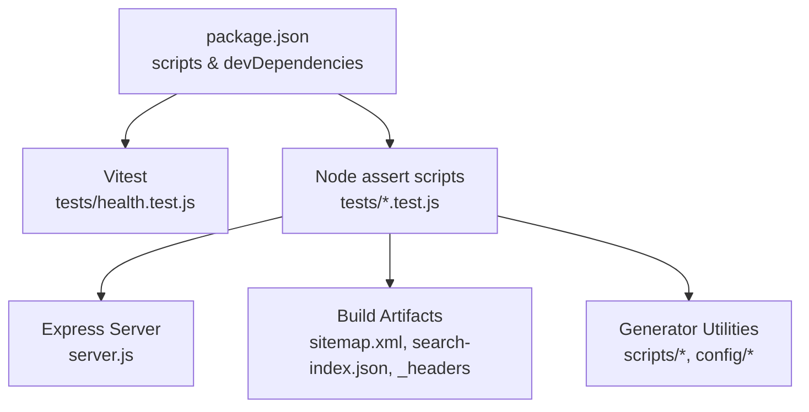
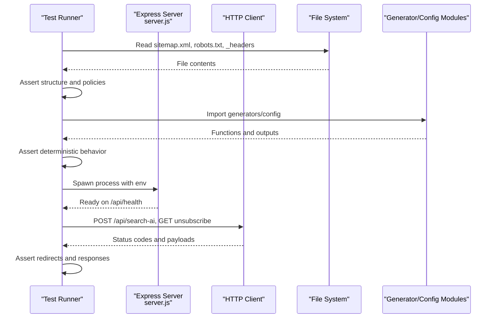
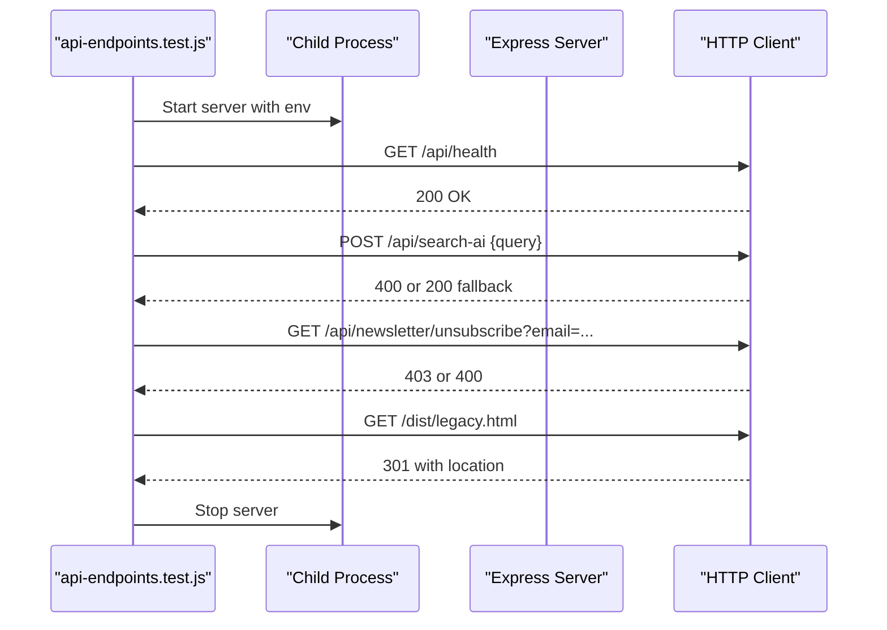
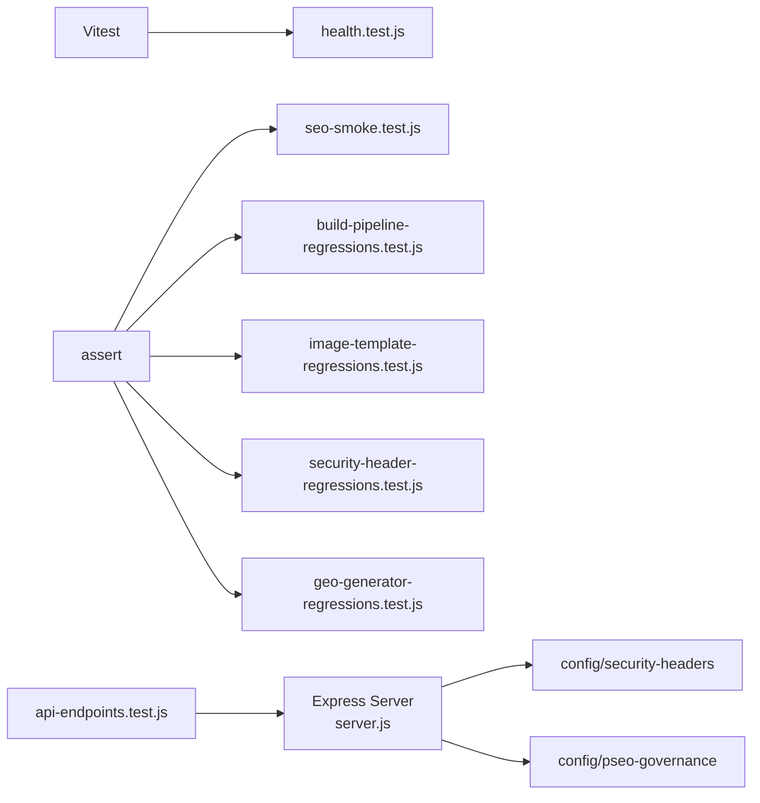

# Unit Testing Framework

<cite>
**Referenced Files in This Document**
- [package.json](file://package.json)
- [server.js](file://server.js)
- [tests/health.test.js](file://tests/health.test.js)
- [tests/api-endpoints.test.js](file://tests/api-endpoints.test.js)
- [tests/seo-smoke.test.js](file://tests/seo-smoke.test.js)
- [tests/build-pipeline-regressions.test.js](file://tests/build-pipeline-regressions.test.js)
- [tests/image-template-regressions.test.js](file://tests/image-template-regressions.test.js)
- [tests/security-header-regressions.test.js](file://tests/security-header-regressions.test.js)
- [tests/geo-generator-regressions.test.js](file://tests/geo-generator-regressions.test.js)
</cite>

## Table of Contents
1. [Introduction](#introduction)
2. [Project Structure](#project-structure)
3. [Core Components](#core-components)
4. [Architecture Overview](#architecture-overview)
5. [Detailed Component Analysis](#detailed-component-analysis)
6. [Dependency Analysis](#dependency-analysis)
7. [Performance Considerations](#performance-considerations)
8. [Troubleshooting Guide](#troubleshooting-guide)
9. [Conclusion](#conclusion)
10. [Appendices](#appendices)

## Introduction
This document explains the unit testing framework used across the WebNovis project. The codebase uses a hybrid approach:
- Vitest for structured, modern test suites with describe/it/expect (e.g., health and static artifact checks).
- Node’s built-in assert module for fast, script-style regression tests that validate build outputs, SEO artifacts, security headers, and generator behavior.
- End-to-end smoke tests that spawn the Express server and exercise live HTTP endpoints.

The goal is to help you write effective unit tests for API endpoints, server health checks, individual components, and build-time utilities; manage mocks and test data; and organize maintainable tests by functionality.

## Project Structure
Tests are organized under the tests directory. There are two primary styles:
- Vitest-based tests using ES modules and describe/it/expect.
- Node scripts using require and assert that run as standalone test commands.

**Diagram sources**
- [package.json:6-60](file://package.json#L6-L60)
- [tests/health.test.js:1-10](file://tests/health.test.js#L1-L10)
- [tests/seo-smoke.test.js:1-10](file://tests/seo-smoke.test.js#L1-L10)
- [tests/build-pipeline-regressions.test.js:1-15](file://tests/build-pipeline-regressions.test.js#L1-L15)
- [server.js:224-287](file://server.js#L224-L287)

**Section sources**
- [package.json:6-60](file://package.json#L6-L60)
- [tests/health.test.js:1-10](file://tests/health.test.js#L1-L10)
- [tests/seo-smoke.test.js:1-10](file://tests/seo-smoke.test.js#L1-L10)
- [tests/build-pipeline-regressions.test.js:1-15](file://tests/build-pipeline-regressions.test.js#L1-L15)

## Core Components
- Health and artifact validation:
  - Sitemap, robots.txt, manifest.json, search index, HTML quality, security headers, and structured data assertions.
- API endpoint smoke tests:
  - Spawns the Express server, waits for readiness via /api/health, and asserts status codes and redirect behavior.
- Build pipeline regressions:
  - Validates package.json scripts and CI workflow expectations to prevent drift.
- Image/template regressions:
  - Ensures templates render expected structure and avoid known pitfalls.
- Security header regressions:
  - Verifies generated _headers file matches shared policy and enforces CSP/HSTS rules.
- Geo generator regressions:
  - Validates generator logic, date handling, template usage, and schema generation.

**Section sources**
- [tests/health.test.js:15-109](file://tests/health.test.js#L15-L109)
- [tests/api-endpoints.test.js:17-129](file://tests/api-endpoints.test.js#L17-L129)
- [tests/build-pipeline-regressions.test.js:15-129](file://tests/build-pipeline-regressions.test.js#L15-L129)
- [tests/image-template-regressions.test.js:14-48](file://tests/image-template-regressions.test.js#L14-L48)
- [tests/security-header-regressions.test.js:16-65](file://tests/security-header-regressions.test.js#L16-L65)
- [tests/geo-generator-regressions.test.js:24-157](file://tests/geo-generator-regressions.test.js#L24-L157)

## Architecture Overview
The testing architecture spans three layers:
- Static artifact validation: reads files from disk and asserts content and structure.
- Generator and utility validation: imports build-time modules and validates their behavior deterministically.
- Live server integration: spawns the Express server and exercises HTTP routes and middleware.

**Diagram sources**
- [tests/health.test.js:15-48](file://tests/health.test.js#L15-L48)
- [tests/security-header-regressions.test.js:16-31](file://tests/security-header-regressions.test.js#L16-L31)
- [tests/geo-generator-regressions.test.js:24-67](file://tests/geo-generator-regressions.test.js#L24-L67)
- [tests/api-endpoints.test.js:17-54](file://tests/api-endpoints.test.js#L17-L54)
- [server.js:224-287](file://server.js#L224-L287)

## Detailed Component Analysis

### Health and Artifact Tests (Vitest)
- Purpose: Validate critical static artifacts and HTML quality.
- Key patterns:
  - Use describe/it/expect to group related checks.
  - Read files relative to project root and assert presence of required elements or values.
  - Check for encoding issues and accessibility markers.
- Example areas covered:
  - Sitemap validity and exclusions.
  - Robots.txt referencing sitemap.
  - Manifest icon uniqueness.
  - Search index existence and array shape.
  - Required meta tags and canonical links.
  - Security headers presence in _headers.
  - Structured data correctness.

**Section sources**
- [tests/health.test.js:15-109](file://tests/health.test.js#L15-L109)

### API Endpoint Smoke Tests (Node + Child Process)
- Purpose: Ensure the running Express server responds correctly to real requests.
- Key patterns:
  - Spawn server process with controlled environment variables.
  - Poll /api/health until ready before issuing requests.
  - Use fetch or node-fetch to send HTTP requests.
  - Assert status codes, headers, and JSON payload shapes.
  - Cleanly terminate server after tests.
- Example scenarios:
  - Invalid query returns 400.
  - Missing API key returns graceful fallback with answer and suggestedPages.
  - Unsubscribe without token returns 403.
  - Redirects from legacy paths to canonical URLs.

**Diagram sources**
- [tests/api-endpoints.test.js:17-129](file://tests/api-endpoints.test.js#L17-L129)
- [server.js:224-287](file://server.js#L224-L287)

**Section sources**
- [tests/api-endpoints.test.js:17-129](file://tests/api-endpoints.test.js#L17-L129)
- [server.js:224-287](file://server.js#L224-L287)

### SEO Smoke Tests (Node assert)
- Purpose: Validate SEO-related build outputs and client-side references.
- Key patterns:
  - Read and parse JSON/XML artifacts.
  - Assert absence of deprecated fields and presence of required entries.
  - Verify client JS fetches correct absolute paths.
  - Detect mojibake tokens in HTML files.

**Section sources**
- [tests/seo-smoke.test.js:11-88](file://tests/seo-smoke.test.js#L11-L88)

### Build Pipeline Regression Tests (Node assert)
- Purpose: Prevent drift between package.json scripts and CI expectations.
- Key patterns:
  - Read package.json and CI workflow YAML.
  - Assert exact script strings and inclusion of specific test files.
  - Ensure dist-first CI command exists and is referenced by workflows.

**Section sources**
- [tests/build-pipeline-regressions.test.js:15-129](file://tests/build-pipeline-regressions.test.js#L15-L129)

### Image and Template Regression Tests (Node assert)
- Purpose: Ensure blog article templates render expected footer sections and avoid known pitfalls.
- Key patterns:
  - Import build utilities and generate sample HTML.
  - Assert presence/absence of classes, attributes, and headings.
  - Scan case study HTML files for broken responsive logo srcset patterns.

**Section sources**
- [tests/image-template-regressions.test.js:14-48](file://tests/image-template-regressions.test.js#L14-L48)

### Security Header Regression Tests (Node assert)
- Purpose: Keep Cloudflare _headers synchronized with shared policy and enforce strict security rules.
- Key patterns:
  - Import shared header builder and compare generated output byte-for-byte.
  - Assert CSP alignment with X-Frame-Options and HSTS presence.
  - Validate path rule formats and verify script dependencies.

**Section sources**
- [tests/security-header-regressions.test.js:16-65](file://tests/security-header-regressions.test.js#L16-L65)

### Geo Generator Regression Tests (Node assert)
- Purpose: Validate geo page generation logic, date handling, and schema consistency.
- Key patterns:
  - Concatenate entry and module sources to assert implementation details.
  - Verify template usage and placeholder replacement.
  - Confirm idempotent cleanup of unsupported rating/review markup.
  - Assert deterministic dates derived from SOURCE_DATE_EPOCH or BUILD_DATE.

**Section sources**
- [tests/geo-generator-regressions.test.js:24-157](file://tests/geo-generator-regressions.test.js#L24-L157)

## Dependency Analysis
- Test runner and assertions:
  - Vitest is declared as a dev dependency and used in health tests.
  - Node’s assert module is used extensively in script-style tests.
- Server dependencies relevant to testing:
  - Express, CORS, compression, rate limiting, and dotenv influence runtime behavior tested by API smoke tests.
- Configuration and utilities:
  - Security headers, pSEO governance, and build-date resolution are imported by tests to validate behavior.

**Diagram sources**
- [package.json:78-89](file://package.json#L78-L89)
- [tests/health.test.js:1-10](file://tests/health.test.js#L1-L10)
- [tests/seo-smoke.test.js:1-10](file://tests/seo-smoke.test.js#L1-L10)
- [tests/build-pipeline-regressions.test.js:1-15](file://tests/build-pipeline-regressions.test.js#L1-L15)
- [tests/image-template-regressions.test.js:1-10](file://tests/image-template-regressions.test.js#L1-L10)
- [tests/security-header-regressions.test.js:1-10](file://tests/security-header-regressions.test.js#L1-L10)
- [tests/geo-generator-regressions.test.js:1-10](file://tests/geo-generator-regressions.test.js#L1-L10)
- [tests/api-endpoints.test.js:1-10](file://tests/api-endpoints.test.js#L1-L10)
- [server.js:8-11](file://server.js#L8-L11)

**Section sources**
- [package.json:78-89](file://package.json#L78-L89)
- [server.js:8-11](file://server.js#L8-L11)

## Performance Considerations
- Prefer lightweight, deterministic checks in Vitest suites for fast feedback (file parsing and regex assertions).
- Use script-style tests for large artifact validations where spawning a full test runner is unnecessary.
- For API smoke tests, minimize network calls and reuse a single spawned server instance per suite to reduce overhead.
- Cache expensive operations within tests when appropriate (e.g., reading large files once and reusing parsed results).

[No sources needed since this section provides general guidance]

## Troubleshooting Guide
- API smoke tests fail to connect:
  - Ensure TEST_PORT is available and not blocked; check server startup logs and /api/health readiness polling.
  - Verify required environment variables are set (e.g., NEWSLETTER_ADMIN_SECRET, API keys).
- Health tests fail on missing artifacts:
  - Run build steps to generate sitemap.xml, search-index.json, and _headers before executing tests.
- Security header mismatches:
  - Re-run the header generator to synchronize _headers with the shared policy; ensure no manual edits exist.
- Geo generator failures:
  - Confirm SOURCE_DATE_EPOCH or BUILD_DATE is set for deterministic dates; check template placeholders and FAQ arrays.
- SEO smoke failures:
  - Validate search-index.json includes required entries and that client JS fetches absolute paths.

**Section sources**
- [tests/api-endpoints.test.js:17-54](file://tests/api-endpoints.test.js#L17-L54)
- [tests/health.test.js:15-48](file://tests/health.test.js#L15-L48)
- [tests/security-header-regressions.test.js:16-31](file://tests/security-header-regressions.test.js#L16-L31)
- [tests/geo-generator-regressions.test.js:56-67](file://tests/geo-generator-regressions.test.js#L56-L67)
- [tests/seo-smoke.test.js:30-65](file://tests/seo-smoke.test.js#L30-L65)

## Conclusion
WebNovis employs a pragmatic, layered testing strategy:
- Vitest for structured, readable suites focused on static artifacts and HTML quality.
- Node assert scripts for fast, targeted regressions covering build outputs, security headers, and generator behavior.
- Live server smoke tests to validate routing, middleware, and API contracts end-to-end.

This combination ensures rapid feedback, robust coverage of critical paths, and protection against regressions in both build-time and runtime behavior.

[No sources needed since this section summarizes without analyzing specific files]

## Appendices

### How to Write Effective Unit Tests
- Organize by functionality:
  - Group related checks under describe blocks in Vitest suites.
  - Use separate script-style tests for distinct concerns (SEO, security, generators).
- Assertions:
  - Use expect for structural and content assertions in Vitest.
  - Use assert.equal/assert.ok/assert.match for precise checks in script-style tests.
- Mocking strategies:
  - For API tests, spawn a real server with controlled environment variables rather than mocking internals.
  - For generator tests, import functions directly and assert deterministic outputs.
- Test data management:
  - Use fixtures embedded in tests or read from stable artifacts (search-index.json, templates).
  - Avoid flaky external dependencies; rely on fallback behaviors when API keys are absent.
- Asynchronous operations:
  - Use async/await for HTTP requests and readiness polling.
  - Wrap timeouts and retries to handle server startup delays.
- Error handling and edge cases:
  - Assert error status codes and payload shapes for invalid inputs.
  - Cover redirects, malformed URLs, and missing resources.

**Section sources**
- [tests/health.test.js:15-109](file://tests/health.test.js#L15-L109)
- [tests/api-endpoints.test.js:17-129](file://tests/api-endpoints.test.js#L17-L129)
- [tests/seo-smoke.test.js:11-88](file://tests/seo-smoke.test.js#L11-L88)
- [tests/build-pipeline-regressions.test.js:15-129](file://tests/build-pipeline-regressions.test.js#L15-L129)
- [tests/image-template-regressions.test.js:14-48](file://tests/image-template-regressions.test.js#L14-L48)
- [tests/security-header-regressions.test.js:16-65](file://tests/security-header-regressions.test.js#L16-L65)
- [tests/geo-generator-regressions.test.js:24-157](file://tests/geo-generator-regressions.test.js#L24-L157)