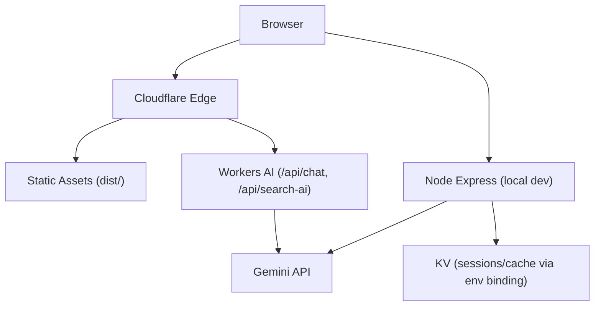
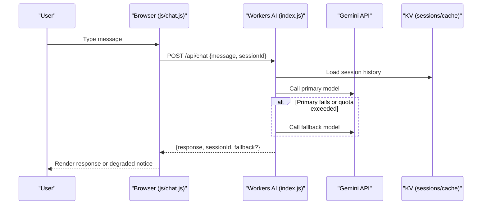
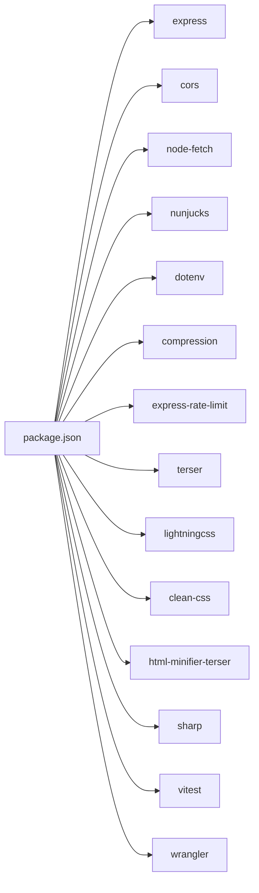

# Common Issues & Solutions

<cite>
**Referenced Files in This Document**
- [README.md](file://README.md)
- [package.json](file://package.json)
- [server.js](file://server.js)
- [build.js](file://build.js)
- [chat-config.json](file://chat-config.json)
- [js/chat.js](file://js/chat.js)
- [workers/webnovis-ai/src/index.js](file://workers/webnovis-ai/src/index.js)
- [workers/webnovis-ai/wrangler.jsonc](file://workers/webnovis-ai/wrangler.jsonc)
- [wrangler.jsonc](file://wrangler.jsonc)
- [scripts/prepare-public-artifact.js](file://scripts/prepare-public-artifact.js)
- [scripts/verify-public-artifact.js](file://scripts/verify-public-artifact.js)
- [docs/deploy/CLOUDFLARE-CONFIGURAZIONE-PASSO-PASSO.md](file://docs/deploy/CLOUDFLARE-CONFIGURAZIONE-PASSO-PASSO.md)
</cite>

## Table of Contents
1. [Introduction](#introduction)
2. [Project Structure](#project-structure)
3. [Core Components](#core-components)
4. [Architecture Overview](#architecture-overview)
5. [Detailed Component Analysis](#detailed-component-analysis)
6. [Dependency Analysis](#dependency-analysis)
7. [Performance Considerations](#performance-considerations)
8. [Troubleshooting Guide](#troubleshooting-guide)
9. [Conclusion](#conclusion)

## Introduction
This document consolidates the most common issues encountered across WebNovis and provides actionable, step-by-step solutions. It covers chatbot connectivity problems (API quotas, timeouts, authentication), build system failures (asset optimization, template rendering, dependency conflicts), deployment issues (Cloudflare Workers configuration, static assets, environment variables), server-side errors (memory leaks, database-like KV limits, middleware stack failures), performance bottlenecks (caching, CDN behavior), and diagnostic commands to identify and fix problems quickly.

## Project Structure
WebNovis is a hybrid project:
- Static site assets built into dist/ for Cloudflare Workers Assets
- Optional Node.js Express server for local development and API endpoints
- Cloudflare Worker for AI chat/search endpoints
- Build pipeline that minifies JS/CSS and optimizes HTML

**Diagram sources**
- [wrangler.jsonc:1-30](file://wrangler.jsonc#L1-L30)
- [workers/webnovis-ai/wrangler.jsonc:1-26](file://workers/webnovis-ai/wrangler.jsonc#L1-L26)
- [workers/webnovis-ai/src/index.js:1-544](file://workers/webnovis-ai/src/index.js#L1-L544)
- [server.js:1-800](file://server.js#L1-L800)

**Section sources**
- [README.md:53-58](file://README.md#L53-L58)
- [package.json:6-60](file://package.json#L6-L60)
- [wrangler.jsonc:1-30](file://wrangler.jsonc#L1-L30)

## Core Components
- Chatbot UI and client logic: js/chat.js
- AI Worker endpoints: workers/webnovis-ai/src/index.js
- Express server (optional): server.js
- Build pipeline: build.js
- Configuration: chat-config.json, wrangler.jsonc, workers/webnovis-ai/wrangler.jsonc

Key responsibilities:
- js/chat.js handles user input, retries, fallbacks, and connection state
- workers/webnovis-ai/src/index.js implements rate limiting, session persistence (KV), prompt building, and Gemini calls with fallback models
- server.js provides local APIs, security headers, redirects, and optional AI proxying
- build.js minifies JS/CSS, discovers assets from HTML, and applies HTML transforms

**Section sources**
- [js/chat.js:1-797](file://js/chat.js#L1-L797)
- [workers/webnovis-ai/src/index.js:1-544](file://workers/webnovis-ai/src/index.js#L1-L544)
- [server.js:1-800](file://server.js#L1-L800)
- [build.js:1-502](file://build.js#L1-L502)
- [chat-config.json:1-109](file://chat-config.json#L1-L109)

## Architecture Overview
The chat flow spans browser → Cloudflare Workers → Gemini API, with robust fallbacks and caching.

**Diagram sources**
- [js/chat.js:430-580](file://js/chat.js#L430-L580)
- [workers/webnovis-ai/src/index.js:266-368](file://workers/webnovis-ai/src/index.js#L266-L368)
- [workers/webnovis-ai/src/index.js:198-247](file://workers/webnovis-ai/src/index.js#L198-L247)
- [workers/webnovis-ai/wrangler.jsonc:19-25](file://workers/webnovis-ai/wrangler.jsonc#L19-L25)

## Detailed Component Analysis

### Chatbot Connectivity Issues
Common symptoms:
- “Assistente non raggiungibile” banner appears after failed requests
- Repeated retries without success
- CORS or network errors in console
- Quota warnings or blocks

Root causes and fixes:
- API quota limits: The worker enforces per-IP rate limits and falls back to local responses when quotas are hit or when the API returns 429/5xx. Ensure correct environment variables and consider increasing limits if needed.
- Network timeouts: The client uses adaptive timeouts and retries; ensure DNS and firewall allow access to the worker domain.
- Authentication failures: If using the Express server locally, ensure required secrets are set; otherwise rely on the public worker endpoint.

Resolution steps:
1. Verify worker health: GET https://webnovis-ai.nexify-api.workers.dev/api/health
2. Check CORS origins: Confirm your origin is allowed in the worker’s default list or via CORS_ORIGINS env var.
3. Inspect logs: Use Wrangler tail to observe errors and quota events.
4. Validate environment: Ensure GEMINI_API_KEY_CHAT and GEMINI_API_KEY_SEARCH are configured in the worker environment.
5. Fallback behavior: When degraded, the UI shows a clear offline notice and suggests contacting the team.

**Section sources**
- [js/chat.js:430-580](file://js/chat.js#L430-L580)
- [workers/webnovis-ai/src/index.js:141-151](file://workers/webnovis-ai/src/index.js#L141-L151)
- [workers/webnovis-ai/src/index.js:266-368](file://workers/webnovis-ai/src/index.js#L266-L368)
- [workers/webnovis-ai/src/index.js:198-247](file://workers/webnovis-ai/src/index.js#L198-L247)
- [workers/webnovis-ai/wrangler.jsonc:15-25](file://workers/webnovis-ai/wrangler.jsonc#L15-L25)

### Build System Failures
Common symptoms:
- Minification errors for CSS/JS
- Missing assets in dist/
- HTML minification skipped or failing
- Dependency resolution issues

Root causes and fixes:
- Asset discovery: The build scans HTML for script/link tags and compiles referenced assets. Ensure paths are correct and files exist.
- Engine fallback: LightningCSS may fail; CleanCSS fallback is used automatically.
- HTML transforms: SEO transforms run during minification; invalid markup can cause skips.

Resolution steps:
1. Run the build and inspect logs for specific file failures.
2. Fix broken asset references in HTML.
3. Add explicit overrides in build config if a file needs special handling.
4. Validate the public artifact to catch missing or unreferenced media/fonts.

**Section sources**
- [build.js:209-276](file://build.js#L209-L276)
- [build.js:315-371](file://build.js#L315-L371)
- [build.js:428-493](file://build.js#L428-L493)
- [scripts/verify-public-artifact.js:320-344](file://scripts/verify-public-artifact.js#L320-L344)

### Deployment Problems
Common symptoms:
- 404s for .html pages or incorrect redirects
- Security headers not applied
- Source files exposed publicly
- Environment variables missing in production

Root causes and fixes:
- html_handling: Must be set to "none" to preserve .html URLs and avoid unwanted redirects.
- Transform rules: CSP and other security headers must be configured at the zone level.
- WAF rules: Block sensitive directories and files from public access.
- Environment variables: Ensure all required keys are set in the worker environment.

Resolution steps:
1. Set assets.html_handling to "none" in wrangler.jsonc.
2. Configure security headers via Cloudflare Transform Rules.
3. Create WAF custom rules to block source exposure.
4. Verify redirects and cache rules for versioned assets.
5. Run verification scripts to confirm correctness.

**Section sources**
- [wrangler.jsonc:1-30](file://wrangler.jsonc#L1-L30)
- [docs/deploy/CLOUDFLARE-CONFIGURAZIONE-PASSO-PASSO.md:28-100](file://docs/deploy/CLOUDFLARE-CONFIGURAZIONE-PASSO-PASSO.md#L28-L100)
- [docs/deploy/CLOUDFLARE-CONFIGURAZIONE-PASSO-PASSO.md:104-159](file://docs/deploy/CLOUDFLARE-CONFIGURAZIONE-PASSO-PASSO.md#L104-L159)
- [docs/deploy/CLOUDFLARE-CONFIGURAZIONE-PASSO-PASSO.md:162-229](file://docs/deploy/CLOUDFLARE-CONFIGURAZIONE-PASSO-PASSO.md#L162-L229)

### Server-Side Errors
Common symptoms:
- Middleware stack failures (CORS, compression, rate limiting)
- Memory growth due to unbounded sessions or caches
- KV storage limits or throttling
- Newsletter or search endpoints failing

Root causes and fixes:
- Rate limiting: Ensure express-rate-limit is installed in production; otherwise the server refuses to start.
- Compression: Optional; missing modules degrade performance but do not crash.
- Session store: In-memory Map has eviction and TTL cleanup; KV-backed worker persists sessions with TTLs.
- KV limits: Sessions and caches use expirationTTL; monitor usage and adjust TTLs.

Resolution steps:
1. Install missing dependencies (compression, express-rate-limit).
2. Review session sizes and TTLs; prune or evict as needed.
3. Validate middleware order and error handling paths.
4. Monitor KV usage and adjust limits/TTLs.

**Section sources**
- [server.js:95-107](file://server.js#L95-L107)
- [server.js:234-249](file://server.js#L234-L249)
- [server.js:584-619](file://server.js#L584-L619)
- [workers/webnovis-ai/src/index.js:178-196](file://workers/webnovis-ai/src/index.js#L178-L196)

## Dependency Analysis
Key runtime and build-time dependencies:
- Runtime: express, cors, node-fetch, nunjucks, dotenv, compression, express-rate-limit
- Dev/build: terser, clean-css, lightningcss, html-minifier-terser, sharp, vitest, wrangler

Potential conflicts:
- Missing dev dependencies break build steps (e.g., html-minifier-terser)
- Production requires express-rate-limit; startup will exit if absent
- KV bindings must be declared in worker config

**Diagram sources**
- [package.json:69-90](file://package.json#L69-L90)

**Section sources**
- [package.json:69-90](file://package.json#L69-L90)
- [server.js:95-107](file://server.js#L95-L107)
- [workers/webnovis-ai/wrangler.jsonc:19-25](file://workers/webnovis-ai/wrangler.jsonc#L19-L25)

## Performance Considerations
- Compression: Enabled in Express; reduces payload size significantly.
- Caching: Static assets served with immutable headers in production; HTML cached with short TTL and stale-while-revalidate.
- CDN: Cloudflare edge caching rules can extend TTL for versioned assets.
- Search AI cache: In-memory cache with TTL and deduplication; worker KV cache for search results.
- KV sessions: Expiration-based cleanup prevents memory growth.

Recommendations:
- Use versioned asset URLs and enable long-lived CDN caching.
- Monitor KV usage and adjust TTLs based on traffic patterns.
- Keep rate limits aligned with expected load to avoid unnecessary fallbacks.

[No sources needed since this section provides general guidance]

## Troubleshooting Guide

### Chatbot Connectivity
Symptoms and diagnostics:
- Error: “API Error: <status>” in browser console
- Banner: “Assistente non raggiungibile”
- Logs: 429 or 5xx from worker

Fix procedures:
1. Health check: curl https://webnovis-ai.nexify-api.workers.dev/api/health
2. Tail logs: npx wrangler tail webnovis-ai
3. Validate CORS: Ensure request Origin matches allowed list
4. Check environment: GEMINI_API_KEY_CHAT and GEMINI_API_KEY_SEARCH set
5. Adjust rate limits: Increase CHAT_RL_LIMIT/SEARCH_RL_WINDOW if necessary

**Section sources**
- [js/chat.js:430-580](file://js/chat.js#L430-L580)
- [workers/webnovis-ai/src/index.js:266-368](file://workers/webnovis-ai/src/index.js#L266-L368)
- [workers/webnovis-ai/src/index.js:141-151](file://workers/webnovis-ai/src/index.js#L141-L151)

### API Quota Limits
Symptoms:
- Quota warning logs
- Fallback responses returned
- 429 responses from worker

Fix procedures:
1. Monitor daily usage counters and thresholds
2. Rotate keys or increase quotas if available
3. Tune rate limits and cache strategies
4. Use fallback responses gracefully in UI

**Section sources**
- [server.js:180-220](file://server.js#L180-L220)
- [workers/webnovis-ai/src/index.js:198-247](file://workers/webnovis-ai/src/index.js#L198-L247)

### Network Timeouts
Symptoms:
- Requests abort after timeout
- Degraded mode activated

Fix procedures:
1. Increase client-side timeout for retries
2. Check DNS and firewall rules
3. Use keepalive and warm-up requests
4. Validate worker availability

**Section sources**
- [js/chat.js:533-580](file://js/chat.js#L533-L580)
- [workers/webnovis-ai/src/index.js:198-247](file://workers/webnovis-ai/src/index.js#L198-L247)

### Authentication Failures
Symptoms:
- 401 responses for protected endpoints
- Admin secret mismatch

Fix procedures:
1. Set NEWSLETTER_ADMIN_SECRET correctly
2. Ensure X-Admin-Secret header matches
3. Use timing-safe comparison to prevent timing attacks

**Section sources**
- [server.js:75-93](file://server.js#L75-L93)

### Build System Failures
Symptoms:
- Minification errors
- Missing assets in dist/
- HTML minification skipped

Fix procedures:
1. Inspect build logs for specific file errors
2. Fix asset references in HTML
3. Add overrides for problematic files
4. Verify public artifact completeness

**Section sources**
- [build.js:290-371](file://build.js#L290-L371)
- [build.js:428-493](file://build.js#L428-L493)
- [scripts/verify-public-artifact.js:320-344](file://scripts/verify-public-artifact.js#L320-L344)

### Template Rendering Issues
Symptoms:
- Incorrect HTML output
- SEO transforms not applied

Fix procedures:
1. Validate HTML structure before minification
2. Ensure output path is correct for transforms
3. Check for unsupported features in templates

**Section sources**
- [build.js:428-493](file://build.js#L428-L493)

### Dependency Conflicts
Symptoms:
- Build fails due to missing modules
- Runtime crashes due to incompatible versions

Fix procedures:
1. Install all dependencies via package manager
2. Pin versions in lockfiles
3. Ensure production-only dependencies are present

**Section sources**
- [package.json:69-90](file://package.json#L69-L90)
- [server.js:95-107](file://server.js#L95-L107)

### Deployment Problems
Symptoms:
- 404s for .html pages
- Security headers missing
- Source files exposed

Fix procedures:
1. Set html_handling to "none"
2. Configure Transform Rules for headers
3. Create WAF rules to block sensitive paths
4. Verify redirects and cache rules

**Section sources**
- [wrangler.jsonc:1-30](file://wrangler.jsonc#L1-L30)
- [docs/deploy/CLOUDFLARE-CONFIGURAZIONE-PASSO-PASSO.md:28-100](file://docs/deploy/CLOUDFLARE-CONFIGURAZIONE-PASSO-PASSO.md#L28-L100)
- [docs/deploy/CLOUDFLARE-CONFIGURAZIONE-PASSO-PASSO.md:104-159](file://docs/deploy/CLOUDFLARE-CONFIGURAZIONE-PASSO-PASSO.md#L104-L159)

### Environment Variable Misconfigurations
Symptoms:
- Endpoints return errors or skip functionality
- Newsletter or search endpoints disabled

Fix procedures:
1. Ensure all required env vars are set in worker and server environments
2. Validate values and formats
3. Restart services after changes

**Section sources**
- [workers/webnovis-ai/src/index.js:311-320](file://workers/webnovis-ai/src/index.js#L311-L320)
- [server.js:228-232](file://server.js#L228-L232)

### Memory Leaks and Session Management
Symptoms:
- Increasing memory usage
- Stale sessions persisting

Fix procedures:
1. Enforce session TTLs and max messages
2. Periodic cleanup of expired sessions
3. Monitor KV usage and adjust TTLs

**Section sources**
- [server.js:584-619](file://server.js#L584-L619)
- [workers/webnovis-ai/src/index.js:178-196](file://workers/webnovis-ai/src/index.js#L178-L196)

### Database Connection Issues (KV)
Symptoms:
- KV read/write failures
- Throttled operations

Fix procedures:
1. Check KV namespace binding and IDs
2. Adjust expirationTTL and key sizes
3. Implement retries and fallbacks

**Section sources**
- [workers/webnovis-ai/wrangler.jsonc:19-25](file://workers/webnovis-ai/wrangler.jsonc#L19-L25)
- [workers/webnovis-ai/src/index.js:141-151](file://workers/webnovis-ai/src/index.js#L141-L151)

### Middleware Stack Failures
Symptoms:
- CORS errors
- Compression not applied
- Rate limiting not active

Fix procedures:
1. Ensure middleware order is correct
2. Install required dependencies
3. Validate configuration options

**Section sources**
- [server.js:234-287](file://server.js#L234-L287)
- [server.js:95-107](file://server.js#L95-L107)

### Performance Bottlenecks and Caching
Symptoms:
- Slow page loads
- High bandwidth usage
- Cache misses

Fix procedures:
1. Enable compression
2. Use versioned assets with long TTLs
3. Configure CDN cache rules for versioned assets
4. Optimize search AI cache and KV usage

**Section sources**
- [server.js:234-249](file://server.js#L234-L249)
- [docs/deploy/CLOUDFLARE-CONFIGURAZIONE-PASSO-PASSO.md:207-229](file://docs/deploy/CLOUDFLARE-CONFIGURAZIONE-PASSO-PASSO.md#L207-L229)

### CDN-Related Problems
Symptoms:
- Stale content served
- Versioned assets not invalidated

Fix procedures:
1. Update asset versions on deploy
2. Configure CDN cache rules for versioned assets
3. Purge cache if necessary

**Section sources**
- [docs/deploy/CLOUDFLARE-CONFIGURAZIONE-PASSO-PASSO.md:207-229](file://docs/deploy/CLOUDFLARE-CONFIGURAZIONE-PASSO-PASSO.md#L207-L229)

## Conclusion
WebNovis includes robust safeguards against common failure modes: rate limiting, fallback responses, session management, and comprehensive build and deployment tooling. By following the diagnostic steps and resolution procedures outlined above, you can quickly identify and resolve issues related to chatbot connectivity, build failures, deployment misconfigurations, and performance bottlenecks. Always verify environment variables, validate worker configurations, and use provided scripts to ensure a healthy production setup.