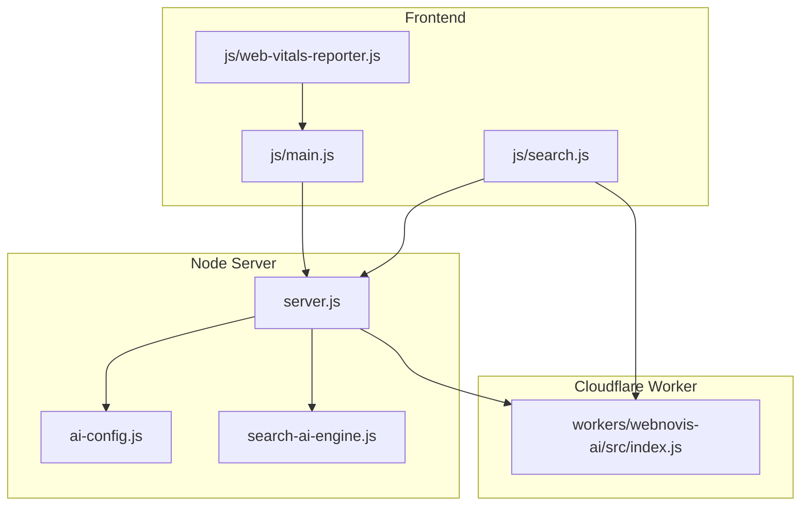
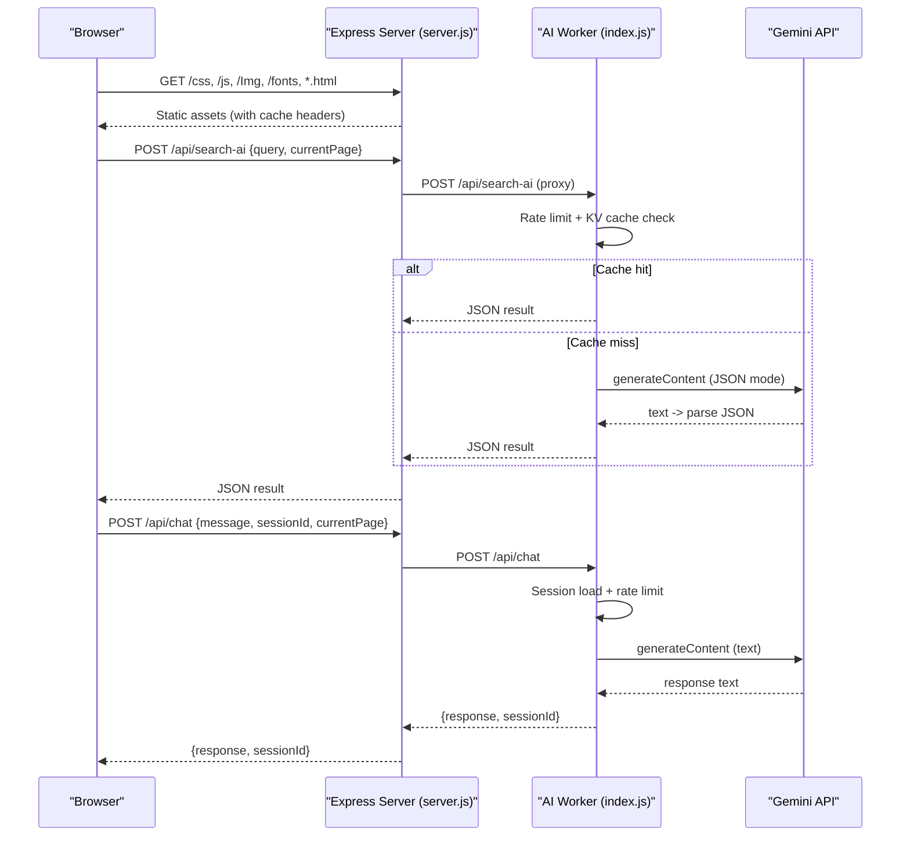
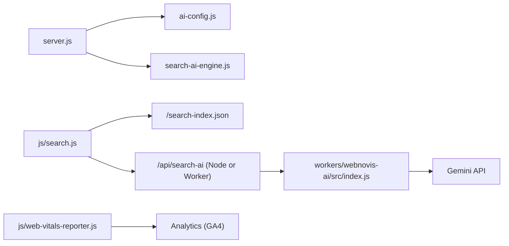

# Debugging Techniques & Tools

<cite>
**Referenced Files in This Document**
- [server.js](file://server.js)
- [package.json](file://package.json)
- [js/main.js](file://js/main.js)
- [js/search.js](file://js/search.js)
- [workers/webnovis-ai/src/index.js](file://workers/webnovis-ai/src/index.js)
- [ai-config.js](file://ai-config.js)
- [search-ai-engine.js](file://search-ai-engine.js)
- [js/web-vitals-reporter.js](file://js/web-vitals-reporter.js)
- [wrangler.jsonc](file://wrangler.jsonc)
- [.dev.vars.example](file://workers/webnovis-ai/.dev.vars.example)
</cite>

## Table of Contents
1. [Introduction](#introduction)
2. [Project Structure](#project-structure)
3. [Core Components](#core-components)
4. [Architecture Overview](#architecture-overview)
5. [Detailed Component Analysis](#detailed-component-analysis)
6. [Dependency Analysis](#dependency-analysis)
7. [Performance Considerations](#performance-considerations)
8. [Troubleshooting Guide](#troubleshooting-guide)
9. [Conclusion](#conclusion)
10. [Appendices](#appendices)

## Introduction
This document provides a comprehensive debugging guide for WebNovis across development and production environments. It covers frontend debugging with browser developer tools, JavaScript debugging, CSS inspection, and performance profiling; backend debugging using Node.js and Express middleware inspection; API endpoint testing; logging strategies and log analysis; error tracking; and specific guidance for AI integration, search functionality, and template rendering issues. Practical commands, console output interpretation, and common workflows are included to streamline troubleshooting.

## Project Structure
WebNovis is a hybrid static site with an Express-based Node.js server that serves HTML/CSS/JS assets and proxies AI-powered features (chat and search). A Cloudflare Worker exposes the AI endpoints used by both the local server and the deployed site. Key directories:
- Root server and configuration files drive asset serving, security headers, redirects, and API routes.
- Frontend JS handles UI interactions, search UX, and optional AI enrichment.
- Workers implement the AI API endpoints with rate limiting, caching, and fallbacks.
- Build scripts generate indexes and artifacts consumed at runtime.

**Diagram sources**
- [server.js:224-320](file://server.js#L224-L320)
- [js/search.js:10-30](file://js/search.js#L10-L30)
- [workers/webnovis-ai/src/index.js:508-543](file://workers/webnovis-ai/src/index.js#L508-L543)
- [search-ai-engine.js:201-230](file://search-ai-engine.js#L201-L230)
- [ai-config.js:1-38](file://ai-config.js#L1-L38)

**Section sources**
- [package.json:1-92](file://package.json#L1-L92)
- [wrangler.jsonc:1-30](file://wrangler.jsonc#L1-L30)

## Core Components
- Express server (server.js): Static asset serving, SEO middleware stack, redirects, CORS, compression, rate limiting, session management, and proxying to AI APIs.
- Search engine (search-ai-engine.js): Local corpus loading, scoring, prompt building, fallback responses, and sanitization.
- AI Worker (workers/webnovis-ai/src/index.js): Endpoints /api/chat, /api/search-ai, /api/chat-lead; rate limiting, KV caching, Gemini calls with fallback models.
- Frontend search (js/search.js): Fuse.js fuzzy search, semantic reranking, AI enrichment via server or worker, accessibility features.
- Frontend main (js/main.js): UI interactions, scroll controller, animations, performance monitoring hooks.
- Vitals reporter (js/web-vitals-reporter.js): Real User Monitoring of Core Web Vitals to analytics.

**Section sources**
- [server.js:224-540](file://server.js#L224-L540)
- [search-ai-engine.js:201-390](file://search-ai-engine.js#L201-L390)
- [workers/webnovis-ai/src/index.js:266-440](file://workers/webnovis-ai/src/index.js#L266-L440)
- [js/search.js:463-512](file://js/search.js#L463-L512)
- [js/main.js:178-284](file://js/main.js#L178-L284)
- [js/web-vitals-reporter.js:1-33](file://js/web-vitals-reporter.js#L1-L33)

## Architecture Overview
The system combines a Node server for static content and API routing with a Cloudflare Worker for AI services. The frontend performs local search and optionally enriches results via AI through either the Node server or the Worker.

**Diagram sources**
- [server.js:742-800](file://server.js#L742-L800)
- [workers/webnovis-ai/src/index.js:370-440](file://workers/webnovis-ai/src/index.js#L370-L440)
- [workers/webnovis-ai/src/index.js:266-368](file://workers/webnovis-ai/src/index.js#L266-L368)

## Detailed Component Analysis

### Node Server Debugging (server.js)
Key areas to inspect:
- Middleware stack: CORS, security headers, X-Robots-Tag, trailing slash normalization, UTM stripping, canonical redirects.
- Static asset handlers: cache policies differ between dev and prod.
- API endpoints: /api/search-ai, /api/chat, rate limiting, quota tracking, session management.
- Logging: bot access logs, quota warnings/errors, startup checks.

Debugging techniques:
- Use node --inspect to attach Chrome DevTools for breakpoints in server code.
- Inspect request/response headers in Network tab to verify CORS, cache-control, and security headers.
- Validate redirect chains and status codes for canonicalization and legacy paths.
- Check console logs for quota warnings and errors; confirm .env variables are loaded.

Common pitfalls:
- Missing GEMINI_API_KEY_SEARCH or GEMINI_API_KEY_CHAT leads to fallback behavior.
- Rate limiting may block requests during heavy usage; monitor retry-after headers.
- Incorrect NODE_ENV affects cache headers and behavior.

Practical commands:
- Start with nodemon for hot reload: npm run dev
- Verify environment: print process.env keys related to AI keys and secrets.
- Tail logs: watch console output for quota warnings and errors.

**Section sources**
- [server.js:224-320](file://server.js#L224-L320)
- [server.js:458-522](file://server.js#L458-L522)
- [server.js:742-800](file://server.js#L742-L800)
- [server.js:180-221](file://server.js#L180-L221)

### Express Middleware Inspection
Focus on:
- CORS origin validation and allowed methods/headers.
- Security headers injection and X-Robots-Tag application.
- Redirect logic for canonical host, trailing slashes, UTM parameters, and legacy paths.
- Compression and static file caching policies.

Debugging tips:
- Temporarily disable middleware to isolate issues.
- Log req.url, req.method, req.headers['origin'], and res.get('Cache-Control') to validate behavior.
- Test with curl or Postman to reproduce edge cases.

**Section sources**
- [server.js:265-319](file://server.js#L265-L319)
- [server.js:325-393](file://server.js#L325-L393)
- [server.js:458-494](file://server.js#L458-L494)

### API Endpoint Testing
Endpoints:
- POST /api/search-ai: Intelligent search powered by Gemini; returns answer, suggestedPages, relatedQueries.
- POST /api/chat: Chatbot conversation; returns response and sessionId.
- Health endpoints: /api/health (Worker), root path (Worker).

Testing approach:
- Use curl or HTTP clients to send payloads and inspect responses.
- Validate JSON schema and field presence.
- Confirm rate limiting behavior and retry-after headers.
- For Worker endpoints, ensure CORS origins match configured values.

Example workflow:
- Send a valid query and verify returned fields.
- Trigger quota limits and observe 429 responses.
- Check fallback responses when API keys are missing.

**Section sources**
- [server.js:742-800](file://server.js#L742-L800)
- [workers/webnovis-ai/src/index.js:508-543](file://workers/webnovis-ai/src/index.js#L508-L543)

### Frontend Debugging (js/main.js, js/search.js)
Frontend responsibilities:
- UI interactions, scroll controller, animations, performance monitoring.
- Local search with Fuse.js, semantic reranking, AI enrichment.

Debugging techniques:
- Breakpoints in search flow: initFuse, searchLocal, shouldRunAiSearch, searchAI.
- Inspect DOM elements for searchWrapper, searchBar, searchResults, mobile modal elements.
- Monitor network requests to /api/search-ai and Worker endpoints.
- Use Performance panel to identify long tasks and layout thrashing.

Common issues:
- Missing index fetch (/search-index.json) causes search failures.
- AI enrichment disabled due to feature flags or timeouts.
- Keyboard navigation not working if live region is absent.

Practical commands:
- Open DevTools Console and filter by “search” to see debug logs.
- Use Sources panel to step through search handlers.
- Validate keyboard shortcuts (Ctrl+K, Tab, Enter, Esc).

**Section sources**
- [js/main.js:178-284](file://js/main.js#L178-L284)
- [js/search.js:463-512](file://js/search.js#L463-L512)
- [js/search.js:515-527](file://js/search.js#L515-L527)
- [js/search.js:530-553](file://js/search.js#L530-L553)

### AI Integration Debugging (Workers and Engine)
Worker endpoints:
- /api/chat: Handles chat messages, sessions, rate limiting, and Gemini calls.
- /api/search-ai: Builds prompts, retrieves docs, caches results, and returns sanitized JSON.

Engine capabilities:
- Corpus loading from search indices.
- Scoring and ranking based on intent and tokens.
- Prompt construction and fallback responses.

Debugging steps:
- Use wrangler tail to stream Worker logs locally.
- Inspect KV cache keys and TTL behavior.
- Validate prompt construction and retrieved documents.
- Confirm fallback responses when API fails or quotas are exceeded.

Environment variables:
- Ensure GEMINI_API_KEY_CHAT and GEMINI_API_KEY_SEARCH are set in .dev.vars or deployment env.
- CORS_ORIGINS must include frontend origins.

**Section sources**
- [workers/webnovis-ai/src/index.js:266-368](file://workers/webnovis-ai/src/index.js#L266-L368)
- [workers/webnovis-ai/src/index.js:370-440](file://workers/webnovis-ai/src/index.js#L370-L440)
- [search-ai-engine.js:201-390](file://search-ai-engine.js#L201-L390)
- [.dev.vars.example:1-8](file://workers/webnovis-ai/.dev.vars.example#L1-L8)

### Template Rendering Errors
Static HTML pages are served directly; templates are Nunjucks files under templates/ but rendered during build. Debugging tips:
- Validate generated HTML for correct structure and links.
- Check build scripts for Nunjucks compilation errors.
- Inspect dist/ artifact for correctness before deployment.

Common issues:
- Missing assets or incorrect paths in built HTML.
- Incorrect cache headers for HTML vs static assets.

**Section sources**
- [server.js:458-522](file://server.js#L458-L522)
- [wrangler.jsonc:1-30](file://wrangler.jsonc#L1-L30)

## Dependency Analysis
Runtime dependencies:
- Express, cors, dotenv, express-rate-limit, node-fetch, nunjucks.
- Development tools: nodemon, vitest, wrangler.

Build-time dependencies:
- Scripts for generating search indices, sitemaps, and public artifacts.

Coupling and cohesion:
- server.js depends on ai-config.js and search-ai-engine.js for AI features.
- Frontend search.js depends on Fuse.js CDN and /search-index.json.
- Worker index.js depends on search-engine module and KV storage.

Potential circular dependencies:
- None detected between core modules; clear separation between server, worker, and frontend.

External integrations:
- Gemini API for chat and search.
- Analytics via web-vitals reporter.

**Diagram sources**
- [server.js:224-320](file://server.js#L224-L320)
- [js/search.js:10-30](file://js/search.js#L10-L30)
- [workers/webnovis-ai/src/index.js:508-543](file://workers/webnovis-ai/src/index.js#L508-L543)
- [js/web-vitals-reporter.js:1-33](file://js/web-vitals-reporter.js#L1-L33)

**Section sources**
- [package.json:69-90](file://package.json#L69-L90)

## Performance Considerations
Frontend:
- Use Performance panel to identify long tasks and layout thrashing.
- Monitor FPS and frame times in main.js performance monitoring.
- Leverage IntersectionObserver and passive event listeners for smooth scrolling.

Backend:
- Enable compression middleware to reduce payload sizes.
- Use rate limiting to protect against abuse and manage API costs.
- Implement KV caching in Worker to reduce latency and API calls.

Real User Monitoring:
- web-vitals-reporter sends CLS, INP, LCP, FCP, TTFB to GA4.
- Validate metrics in analytics dashboard and correlate with user feedback.

Optimization opportunities:
- Debounce and throttle expensive operations.
- Pre-warm fetch instance to avoid cold-start latency.
- Prune caches and sessions periodically.

**Section sources**
- [js/main.js:1494-1505](file://js/main.js#L1494-L1505)
- [server.js:234-249](file://server.js#L234-L249)
- [workers/webnovis-ai/src/index.js:141-151](file://workers/webnovis-ai/src/index.js#L141-L151)
- [js/web-vitals-reporter.js:1-33](file://js/web-vitals-reporter.js#L1-L33)

## Troubleshooting Guide
Common issues and resolutions:
- AI key missing: Verify GEMINI_API_KEY_SEARCH and GEMINI_API_KEY_CHAT in environment; fallback responses will be used.
- Rate limiting triggered: Observe retry-after headers; adjust client-side retry logic.
- CORS errors: Ensure origins match configured values in server and Worker.
- Search index missing: Confirm /search-index.json is available and fetch succeeds.
- Quota exceeded: Monitor console logs for quota warnings; consider scaling or optimizing prompts.

Logging strategies:
- Bot access logs written to bot-access.log for crawl intelligence.
- Quota warnings and errors logged to console; integrate with external logging systems in production.
- Worker logs streamed via wrangler tail for real-time debugging.

Error tracking implementation:
- Use try/catch blocks around API calls and JSON parsing.
- Return structured error responses with status codes and messages.
- Track fallback usage and session states for diagnostics.

Debugging commands:
- Start server: npm run dev
- Tail Worker logs: npx wrangler tail webnovis-ai
- Verify health: curl https://webnovis-ai.nexify-api.workers.dev/api/health
- Test search: curl -X POST http://localhost:3000/api/search-ai -H "Content-Type: application/json" -d '{"query":"test","currentPage":"/"}'

**Section sources**
- [server.js:180-221](file://server.js#L180-L221)
- [workers/webnovis-ai/src/index.js:141-151](file://workers/webnovis-ai/src/index.js#L141-L151)
- [package.json:55-58](file://package.json#L55-L58)

## Conclusion
This guide equips developers with practical debugging techniques for WebNovis across frontend, backend, and AI components. By leveraging browser developer tools, Node.js debugging, Express middleware inspection, and Worker logging, teams can efficiently diagnose and resolve issues. Implementing robust logging, error tracking, and performance monitoring ensures reliable operation in both development and production environments.

## Appendices
- Environment setup: Copy .dev.vars.example to .dev.vars and populate API keys.
- Deployment: Use wrangler deploy for Worker and static assets; ensure dist/ artifact is correct.
- CI/CD: Run quality gates and tests via npm scripts defined in package.json.

**Section sources**
- [.dev.vars.example:1-8](file://workers/webnovis-ai/.dev.vars.example#L1-L8)
- [wrangler.jsonc:1-30](file://wrangler.jsonc#L1-L30)
- [package.json:46-58](file://package.json#L46-L58)