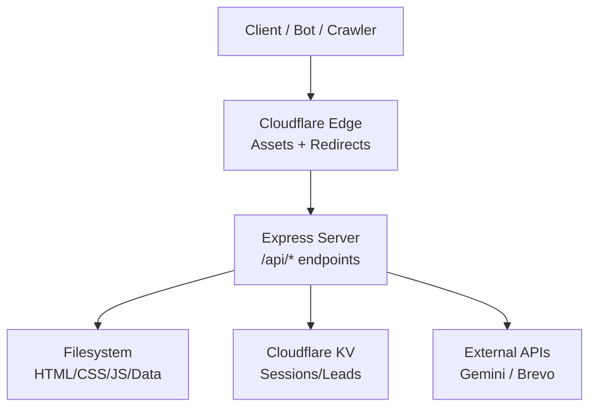
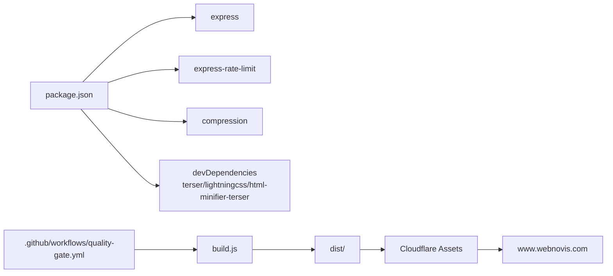

# Maintenance Procedures & Runbooks

<cite>
**Referenced Files in This Document**
- [package.json](file://package.json)
- [server.js](file://server.js)
- [build.js](file://build.js)
- [wrangler.jsonc](file://wrangler.jsonc)
- [workers/webnovis-ai/wrangler.jsonc](file://workers/webnovis-ai/wrangler.jsonc)
- [workers/webnovis-forms/wrangler.jsonc](file://workers/webnovis-forms/wrangler.jsonc)
- [.github/workflows/quality-gate.yml](file://.github/workflows/quality-gate.yml)
- [.github/workflows/daily-blog.yml](file://.github/workflows/daily-blog.yml)
- [scripts/monitor-seo.js](file://scripts/monitor-seo.js)
- [scripts/verify-prod-headers.js](file://scripts/verify-prod-headers.js)
- [README.md](file://README.md)
</cite>

## Table of Contents
1. Introduction
2. Project Structure
3. Core Components
4. Architecture Overview
5. Detailed Component Analysis
6. Dependency Analysis
7. Performance Considerations
8. Troubleshooting Guide
9. Conclusion
10. Appendices

## Introduction
This document provides operational runbooks and maintenance procedures for WebNovis, covering routine tasks (database cleanup, cache management, log rotation, temporary files), backup and recovery, performance monitoring, health checks, alerting, dependency updates, security patching, system upgrades, disaster recovery, data migration, rollback strategies, seasonal maintenance, capacity planning, and resource optimization. It is grounded in the repository’s runtime server, build pipeline, Cloudflare Workers configuration, CI workflows, and monitoring scripts.

## Project Structure
WebNovis runs as a Node.js Express server with optional static hosting via Cloudflare Pages/Workers. The build pipeline minifies assets and prepares a public artifact for deployment. CI enforces quality gates and production header verification. AI features are exposed through both the Express server and Cloudflare Workers.



**Diagram sources**
- [wrangler.jsonc:1-30](file://wrangler.jsonc#L1-L30)
- [server.js:224-526](file://server.js#L224-L526)
- [workers/webnovis-ai/wrangler.jsonc:1-26](file://workers/webnovis-ai/wrangler.jsonc#L1-L26)

**Section sources**
- [wrangler.jsonc:1-30](file://wrangler.jsonc#L1-L30)
- [server.js:224-526](file://server.js#L224-L526)
- [README.md:47-58](file://README.md#L47-L58)

## Core Components
- Runtime server: Express app serving static assets, redirects, security headers, rate limiting, session management, and AI search/chat endpoints.
- Build pipeline: Asset discovery, JS/CSS minification, HTML transforms, and artifact preparation for deployment.
- Deployment target: Cloudflare Assets with explicit html_handling to preserve .html URLs; Workers for AI and forms.
- CI/Quality: GitHub Actions jobs that build, test, verify headers, and publish artifacts.
- Monitoring: SEO monitor script and production header verifier used in CI and ad-hoc runs.

**Section sources**
- [server.js:224-526](file://server.js#L224-L526)
- [build.js:373-495](file://build.js#L373-L495)
- [wrangler.jsonc:1-30](file://wrangler.jsonc#L1-L30)
- [.github/workflows/quality-gate.yml:1-47](file://.github/workflows/quality-gate.yml#L1-L47)
- [scripts/monitor-seo.js:310-336](file://scripts/monitor-seo.js#L310-L336)
- [scripts/verify-prod-headers.js:99-133](file://scripts/verify-prod-headers.js#L99-L133)

## Architecture Overview
The system combines a Node.js backend with static asset delivery on Cloudflare. The server handles API endpoints, caching headers, redirects, and rate limits. The build pipeline produces a sanitized dist/ artifact. CI ensures quality and header compliance before deployment.

```mermaid
sequenceDiagram
participant U as "User/Bot"
participant E as "Cloudflare Edge"
participant S as "Express Server"
participant B as "Build Pipeline"
participant D as "Dist Artifact"
participant W as "Workers (AI/Forms)"
U->>E : Request site/API
E->>S : Route to Express or serve static
S-->>U : Static files / API response
Note over S,W : AI/search uses Gemini; leads use Brevo/KV
U->>B : Trigger build (CI/manual)
B-->>D : Produce dist/
D-->>E : Deployed assets
```

**Diagram sources**
- [server.js:224-526](file://server.js#L224-L526)
- [build.js:373-495](file://build.js#L373-L495)
- [wrangler.jsonc:1-30](file://wrangler.jsonc#L1-L30)
- [workers/webnovis-ai/wrangler.jsonc:1-26](file://workers/webnovis-ai/wrangler.jsonc#L1-L26)

## Detailed Component Analysis

### Routine Maintenance Tasks

#### Database Cleanup
- In-memory sessions: The server maintains an in-memory session store with TTL-based eviction and periodic cleanup every 5 minutes. No external database is used by the server.
- Cloudflare KV: The AI Worker stores leads and session metadata in KV with expiration TTLs.

Operational steps:
- Verify session cleanup interval and max concurrent sessions are appropriate for your traffic profile.
- For KV retention, adjust TTLs in the Worker configuration if needed.

Verification:
- Confirm no memory growth beyond expected session caps during load tests.
- Inspect KV namespace usage and TTL behavior via Wrangler or Cloudflare dashboard.

**Section sources**
- [server.js:584-619](file://server.js#L584-L619)
- [workers/webnovis-ai/wrangler.jsonc:19-25](file://workers/webnovis-ai/wrangler.jsonc#L19-L25)

#### Cache Management
- Static assets: Long-lived immutable cache in production; no-cache in development.
- HTML pages: Short cache with stale-while-revalidate for fast refresh after deployments.
- Search AI results: In-memory cache with TTL and size cap; in-flight deduplication to avoid duplicate API calls.

Operational steps:
- Ensure NODE_ENV is set correctly to toggle cache policies.
- Monitor search cache hit rates and prune thresholds; adjust TTL and max entries if necessary.

Verification:
- Check response headers for Cache-Control and CDN-specific headers.
- Validate that repeated queries return cached responses within TTL.

**Section sources**
- [server.js:458-526](file://server.js#L458-L526)
- [server.js:646-673](file://server.js#L646-L673)

#### Log Rotation and Temporary File Handling
- Bot access logs: Written to a file with simple rotation when exceeding a size threshold.
- Leads log: JSONL append-only file for lead events.

Operational steps:
- Implement OS-level log rotation (e.g., logrotate) for bot-access.log and leads-log.jsonl to prevent disk growth.
- Archive rotated logs securely and purge old archives per retention policy.

Verification:
- Confirm log files do not exceed configured thresholds between rotations.
- Validate log format integrity for downstream analysis.

**Section sources**
- [server.js:395-429](file://server.js#L395-L429)
- [server.js:910-933](file://server.js#L910-L933)

#### Content and Configuration Backups
- Data layer: JSON datasets under data/ (services, geo-editorial, cities, link graph).
- Configurations: Environment variables (.env), wrangler configs, and site config JSONs.
- Generated artifacts: dist/ contains minified assets and transformed HTML.

Backup procedure:
- Snapshot data/, config/, and generated artifacts (dist/) regularly.
- Version control changes to configuration and content files.
- Store backups offsite with encryption and enforce retention policies.

Recovery procedure:
- Restore data/config from latest known-good snapshot.
- Rebuild artifacts using the build pipeline to ensure consistency.
- Redeploy via CI/CD to propagate changes.

**Section sources**
- [package.json:6-60](file://package.json#L6-L60)
- [wrangler.jsonc:1-30](file://wrangler.jsonc#L1-L30)

#### Health Checks and Alerting
- Built-in health indicators:
  - Rate limiters protect endpoints and surface errors when exceeded.
  - Quota tracking warns and blocks API usage near daily caps.
  - Production header verifier checks critical security headers in CI.
- Monitoring:
  - SEO monitor script aggregates alerts for broken links, link graph mismatches, and data layer issues.

Operational steps:
- Integrate uptime probes to hit key endpoints (/ and /api/search-ai) and assert status codes.
- Configure alerts for quota warnings and CI failures (header mismatches, build errors).
- Use the SEO monitor output to trigger alerts on critical issues.

Verification:
- Confirm CI fails on missing headers or build regressions.
- Validate that quota warnings appear in logs and block requests at hard caps.

**Section sources**
- [server.js:95-107](file://server.js#L95-L107)
- [server.js:180-220](file://server.js#L180-L220)
- [scripts/monitor-seo.js:310-336](file://scripts/monitor-seo.js#L310-L336)
- [scripts/verify-prod-headers.js:99-133](file://scripts/verify-prod-headers.js#L99-L133)
- [.github/workflows/quality-gate.yml:41-47](file://.github/workflows/quality-gate.yml#L41-L47)

#### Dependency Updates and Security Patching
- Dependencies are declared in package.json; devDependencies include tooling for builds and tests.
- CI installs dependencies and runs quality gates on push to main and PRs.

Operational steps:
- Regularly review and update dependencies using npm/yarn/pnpm audit and upgrade tools.
- Run full CI quality gate locally or in CI before merging updates.
- Pin versions where stability is critical; document breaking changes.

Verification:
- Ensure all tests pass post-update.
- Confirm build artifacts remain valid and no regressions in headers or functionality.

**Section sources**
- [package.json:69-90](file://package.json#L69-L90)
- [.github/workflows/quality-gate.yml:14-31](file://.github/workflows/quality-gate.yml#L14-L31)

#### System Upgrade Procedures
- Node.js runtime: Update Node version in CI setup and local environment; validate compatibility with dependencies.
- Cloudflare Workers: Update compatibility dates and flags as needed; redeploy workers with new configs.
- Build pipeline: Adjust minification options only after thorough testing.

Operational steps:
- Test upgrades in a staging branch; run full CI quality gate.
- Deploy via CI/CD; verify headers and functionality post-deploy.
- Roll back to previous commit if issues arise.

Verification:
- Confirm runtime behavior and worker observability settings are intact.
- Validate that assets and redirects behave as expected.

**Section sources**
- [.github/workflows/quality-gate.yml:18-25](file://.github/workflows/quality-gate.yml#L18-L25)
- [workers/webnovis-ai/wrangler.jsonc:1-18](file://workers/webnovis-ai/wrangler.jsonc#L1-L18)
- [build.js:373-495](file://build.js#L373-L495)

#### Disaster Recovery Planning
- Scope: Data files (data/), configurations (.env, wrangler configs), generated artifacts (dist/), and external integrations (Gemini, Brevo).
- Strategy:
  - Maintain offsite backups with encryption and defined retention.
  - Document restore procedures and test them periodically.
  - Define RTO/RPO targets aligned with business needs.

Operational steps:
- Automate backups of data/, config/, and dist/.
- Practice restores in isolated environments to validate integrity.
- Prepare incident runbooks for service outages and data loss scenarios.

Verification:
- Successful restore and rebuild of site with minimal downtime.
- External integrations reconnected and functioning.

[No sources needed since this section provides general guidance]

#### Data Migration Processes
- When migrating data structures or content schemas:
  - Create migration scripts that transform existing data safely.
  - Run migrations in a non-production environment first.
  - Validate outputs and roll back if validation fails.

Operational steps:
- Version migration scripts alongside data schema changes.
- Execute migrations via CI or controlled scripts; log outcomes.
- Rebuild artifacts and redeploy after successful migration.

Verification:
- Post-migration checks against expected schema and content.
- Functional tests pass; no regressions in rendering or API responses.

[No sources needed since this section provides general guidance]

#### Rollback Strategies
- Git-based rollback: Revert to last known-good commit and redeploy.
- Artifact rollback: Reuse previous dist/ snapshot if available.
- Worker rollback: Redeploy previous worker versions via Wrangler.

Operational steps:
- Tag releases and maintain changelogs.
- Keep recent artifacts and worker versions accessible.
- Automate rollback via CI/CD pipelines.

Verification:
- Confirm services respond correctly and headers are compliant after rollback.
- Validate data integrity and feature parity.

[No sources needed since this section provides general guidance]

### Operational Runbooks

#### Runbook: Rotate Logs and Clean Temp Files
- Required permissions: Write access to log directories; OS-level log rotation privileges.
- Steps:
  - Identify log files (bot-access.log, leads-log.jsonl).
  - Configure log rotation to rotate by size/time and archive old logs.
  - Purge expired archives per retention policy.
- Verification:
  - Confirm log sizes remain within thresholds.
  - Validate log continuity and format.

**Section sources**
- [server.js:395-429](file://server.js#L395-L429)
- [server.js:910-933](file://server.js#L910-L933)

#### Runbook: Clear and Tune Search AI Cache
- Required permissions: Access to server logs and environment configuration.
- Steps:
  - Review current TTL and max entries for search cache.
  - Adjust parameters based on traffic patterns and API quotas.
  - Monitor cache hit rates and quota warnings.
- Verification:
  - Observe reduced redundant API calls and improved latency.
  - Ensure quota warnings do not indicate imminent caps.

**Section sources**
- [server.js:646-673](file://server.js#L646-L673)
- [server.js:180-220](file://server.js#L180-L220)

#### Runbook: Backup Data and Configurations
- Required permissions: Read access to data/, config/, and dist/; write access to backup storage.
- Steps:
  - Snapshot data/, config/, and dist/ to secure offsite storage.
  - Encrypt backups and enforce retention policies.
  - Document restore steps and schedule periodic restore drills.
- Verification:
  - Successful restore in isolated environment.
  - Site rebuild and deploy succeed post-restore.

**Section sources**
- [package.json:6-60](file://package.json#L6-L60)
- [wrangler.jsonc:1-30](file://wrangler.jsonc#L1-L30)

#### Runbook: Apply Dependency Updates Safely
- Required permissions: Repository write access; CI runner access.
- Steps:
  - Audit dependencies for vulnerabilities and updates.
  - Update package manifests and lockfiles.
  - Run full CI quality gate; fix regressions.
  - Merge and deploy via CI/CD.
- Verification:
  - All tests pass; headers verified; no build errors.
  - Performance and functionality validated.

**Section sources**
- [package.json:69-90](file://package.json#L69-L90)
- [.github/workflows/quality-gate.yml:14-31](file://.github/workflows/quality-gate.yml#L14-L31)

#### Runbook: Deploy Site and Workers
- Required permissions: Wrangler CLI access; repository write access.
- Steps:
  - Build site artifact using the build pipeline.
  - Dry-run deployment to validate configuration.
  - Deploy assets and workers; verify headers and functionality.
- Verification:
  - CI quality gate passes; production headers verified.
  - Endpoints respond correctly; assets served with proper caching.

**Section sources**
- [wrangler.jsonc:1-30](file://wrangler.jsonc#L1-L30)
- [package.json:51-58](file://package.json#L51-L58)
- [.github/workflows/quality-gate.yml:41-47](file://.github/workflows/quality-gate.yml#L41-L47)

#### Runbook: Monitor SEO and Link Graph Integrity
- Required permissions: Access to logs and data files; ability to run scripts.
- Steps:
  - Execute SEO monitor script to generate reports and alerts.
  - Address critical alerts (broken links, graph mismatches).
  - Schedule regular runs to detect regressions early.
- Verification:
  - Alerts resolved; link graph matches rendered corpus.
  - Data layer health indicates expected state.

**Section sources**
- [scripts/monitor-seo.js:310-336](file://scripts/monitor-seo.js#L310-L336)

#### Runbook: Enforce Production Headers
- Required permissions: Access to production site URL; CI runner.
- Steps:
  - Run production header verifier against live endpoints.
  - Fix mismatches in server middleware or edge configuration.
  - Include verification in CI to prevent regressions.
- Verification:
  - No critical header mismatches; warnings documented and managed.

**Section sources**
- [scripts/verify-prod-headers.js:99-133](file://scripts/verify-prod-headers.js#L99-L133)
- [.github/workflows/quality-gate.yml:41-47](file://.github/workflows/quality-gate.yml#L41-L47)

### Seasonal Maintenance, Capacity Planning, and Resource Optimization

- Seasonal maintenance:
  - Review and update security headers and CORS policies.
  - Refresh content and link graphs; regenerate sitemaps and indexes.
  - Validate AI model prompts and quotas; adjust thresholds seasonally.

- Capacity planning:
  - Monitor session concurrency limits and search cache sizes.
  - Scale Workers KV usage and plan for growth in leads and sessions.
  - Evaluate CDN caching effectiveness and adjust TTLs.

- Resource optimization:
  - Minify assets and apply HTML transforms in build pipeline.
  - Enable compression middleware for text assets.
  - Optimize image policies and asset discovery to reduce payload sizes.

**Section sources**
- [server.js:234-249](file://server.js#L234-L249)
- [build.js:373-495](file://build.js#L373-L495)
- [wrangler.jsonc:1-30](file://wrangler.jsonc#L1-L30)

## Dependency Analysis
The project depends on Express for routing, rate limiting, and compression; build tools for asset processing; and Cloudflare Workers for edge capabilities. CI orchestrates quality checks and deployment validations.



**Diagram sources**
- [package.json:69-90](file://package.json#L69-L90)
- [.github/workflows/quality-gate.yml:14-31](file://.github/workflows/quality-gate.yml#L14-L31)
- [build.js:373-495](file://build.js#L373-L495)
- [wrangler.jsonc:1-30](file://wrangler.jsonc#L1-L30)

**Section sources**
- [package.json:69-90](file://package.json#L69-L90)
- [.github/workflows/quality-gate.yml:14-31](file://.github/workflows/quality-gate.yml#L14-L31)
- [build.js:373-495](file://build.js#L373-L495)
- [wrangler.jsonc:1-30](file://wrangler.jsonc#L1-L30)

## Performance Considerations
- Compression middleware reduces transfer size for text assets.
- Static assets use long-lived immutable caching in production; HTML uses short cache with stale-while-revalidate.
- Search AI cache minimizes redundant API calls and respects quotas.
- Build pipeline minifies JS/CSS and optimizes HTML, improving load times.

[No sources needed since this section provides general guidance]

## Troubleshooting Guide
- Missing rate limiter in production: Server refuses to start without express-rate-limit in production mode.
- Header mismatches: CI verifies production headers; failures indicate misconfiguration in server or edge.
- SEO regressions: Monitor script detects broken links and graph mismatches; address critical alerts promptly.

**Section sources**
- [server.js:95-107](file://server.js#L95-L107)
- [scripts/verify-prod-headers.js:99-133](file://scripts/verify-prod-headers.js#L99-L133)
- [scripts/monitor-seo.js:310-336](file://scripts/monitor-seo.js#L310-L336)

## Conclusion
WebNovis employs a robust runtime and build pipeline with strong security and caching practices. Operational runbooks cover routine maintenance, backups, monitoring, updates, and disaster recovery. CI ensures quality and compliance, while Workers extend capabilities at the edge. Following these procedures will maintain reliability, performance, and security across seasons and growth phases.

[No sources needed since this section summarizes without analyzing specific files]

## Appendices

### Appendix A: Quick Commands Reference
- Start server: npm start
- Build site artifact: npm run build:site:dist
- Deploy site: npm run deploy:site
- Deploy workers: npm run ai:deploy / npm run forms:deploy
- Run SEO monitor: npm run monitor:seo
- Verify production headers: npm run verify:prod-headers

**Section sources**
- [package.json:6-60](file://package.json#L6-L60)

### Appendix B: Environment Variables Summary
- GEMINI_API_KEY_CHAT, GEMINI_API_KEY_SEARCH: AI integration keys
- BREVO_API_KEY, BREVO_LIST_ID, BREVO_SENDER_EMAIL, BREVO_SENDER_NAME, BREVO_NOTIFICATION_EMAIL: Newsletter and lead notifications
- NEWSLETTER_ADMIN_SECRET: Admin authentication secret
- NODE_ENV, PORT: Runtime configuration

**Section sources**
- [README.md:218-232](file://README.md#L218-L232)