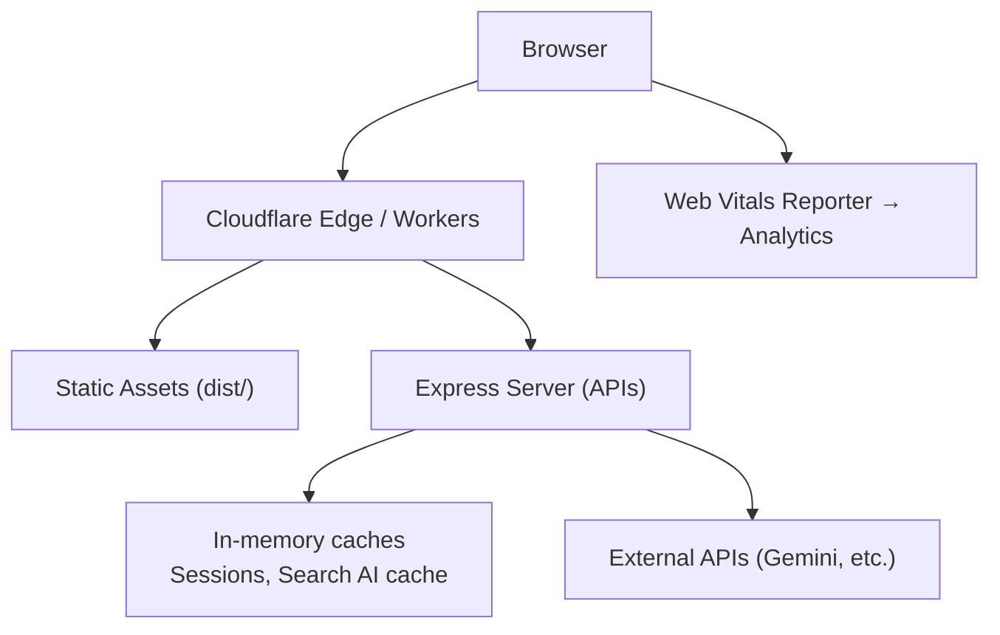
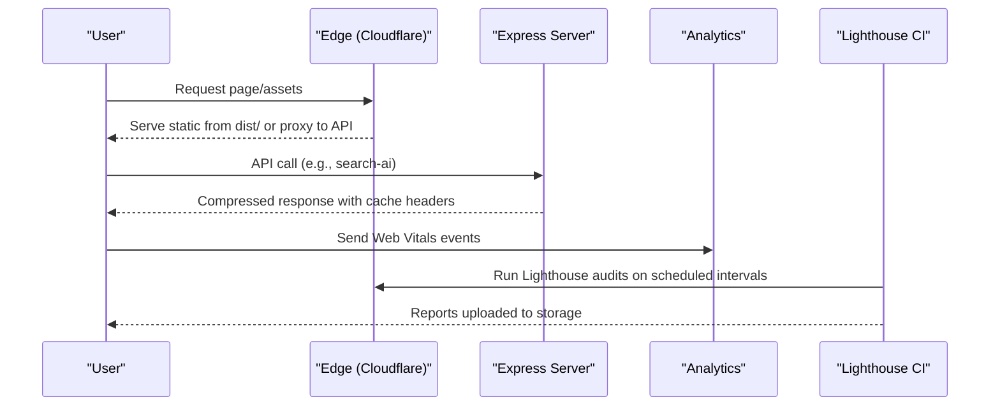
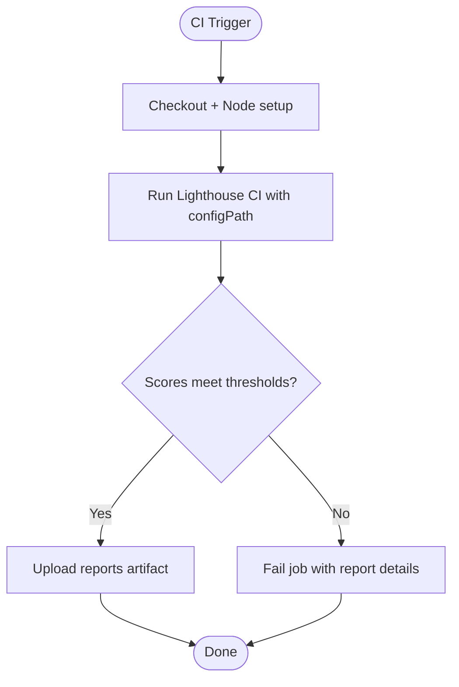
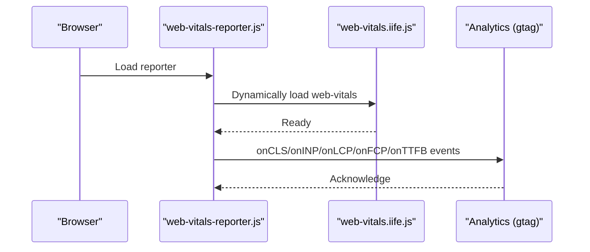
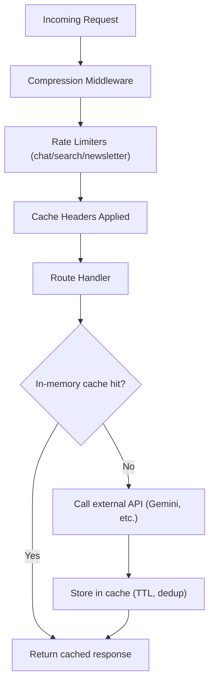
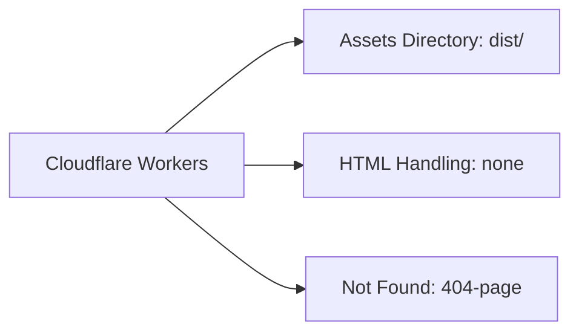
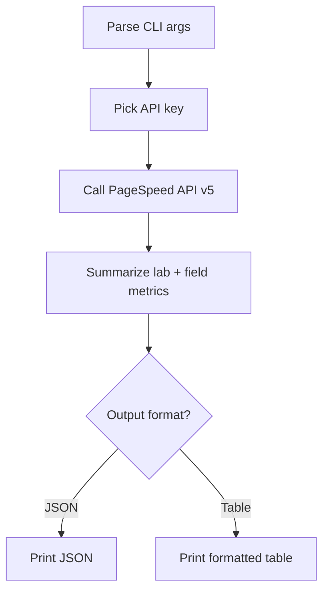
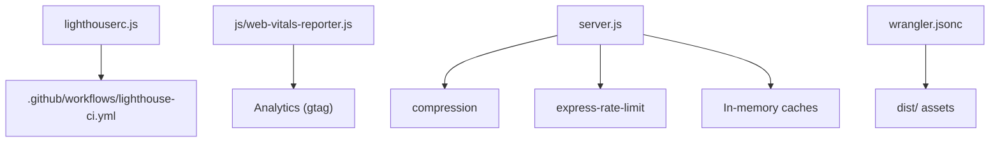

# Performance Troubleshooting & Optimization

<cite>
**Referenced Files in This Document**
- [lighthouserc.js](file://lighthouserc.js)
- [.github/workflows/lighthouse-ci.yml](file://.github/workflows/lighthouse-ci.yml)
- [js/web-vitals-reporter.js](file://js/web-vitals-reporter.js)
- [server.js](file://server.js)
- [package.json](file://package.json)
- [wrangler.jsonc](file://wrangler.jsonc)
- [config/security-headers.js](file://config/security-headers.js)
- [scripts/run-pagespeed-api.js](file://scripts/run-pagespeed-api.js)
- [docs/PERFORMANCE-OPTIMIZATION-REPORT.md](file://docs/PERFORMANCE-OPTIMIZATION-REPORT.md)
- [docs/deploy/CLOUDFLARE-CONFIGURAZIONE-PASSO-PASSO.md](file://docs/deploy/CLOUDFLARE-CONFIGURAZIONE-PASSO-PASSO.md)
</cite>

## Table of Contents
1. [Introduction](#introduction)
2. [Project Structure](#project-structure)
3. [Core Components](#core-components)
4. [Architecture Overview](#architecture-overview)
5. [Detailed Component Analysis](#detailed-component-analysis)
6. [Dependency Analysis](#dependency-analysis)
7. [Performance Considerations](#performance-considerations)
8. [Troubleshooting Guide](#troubleshooting-guide)
9. [Conclusion](#conclusion)
10. [Appendices](#appendices)

## Introduction
This document provides a comprehensive performance troubleshooting and optimization guide for WebNovis. It covers:
- Setting up performance monitoring with Lighthouse CI, Web Vitals, and custom metrics collection
- Identifying and resolving frontend and backend bottlenecks
- Asset optimization, bundle size management, and loading performance
- Server-side tuning including memory usage, query efficiency, and API response time
- Load testing, stress testing, and capacity planning
- Caching strategy optimization, CDN configuration, and edge computing performance tuning

The guidance is grounded in the repository’s existing scripts, server middleware, and deployment configuration to ensure actionable, code-aligned recommendations.

## Project Structure
WebNovis uses a static site served via Cloudflare Workers (assets directory configured in wrangler.jsonc), an Express-based Node.js server for APIs and dynamic routes, and a robust CI pipeline that runs Lighthouse audits on key pages. Frontend performance telemetry is collected via a Web Vitals reporter that sends Core Web Vitals to analytics.

**Diagram sources**
- [wrangler.jsonc:22-28](file://wrangler.jsonc#L22-L28)
- [server.js:224-287](file://server.js#L224-L287)
- [server.js:458-526](file://server.js#L458-L526)
- [js/web-vitals-reporter.js:1-33](file://js/web-vitals-reporter.js#L1-L33)

**Section sources**
- [wrangler.jsonc:1-30](file://wrangler.jsonc#L1-L30)
- [server.js:224-526](file://server.js#L224-L526)
- [js/web-vitals-reporter.js:1-33](file://js/web-vitals-reporter.js#L1-L33)

## Core Components
- Lighthouse CI configuration and workflow for automated performance auditing
- Web Vitals reporter for real-user metric collection
- Express server with compression, rate limiting, caching headers, and in-memory caches
- Cloudflare Workers assets configuration for static hosting and edge behavior
- PageSpeed Insights script for lab and field metric summaries

Key responsibilities:
- Automated performance gates and reporting (Lighthouse CI)
- Real-time user experience measurement (Web Vitals)
- Efficient request handling and caching (Express + headers)
- Edge delivery and asset serving (Cloudflare Workers)
- Diagnostic tooling for performance analysis (PageSpeed script)

**Section sources**
- [lighthouserc.js:1-28](file://lighthouserc.js#L1-L28)
- [.github/workflows/lighthouse-ci.yml:1-27](file://.github/workflows/lighthouse-ci.yml#L1-L27)
- [js/web-vitals-reporter.js:1-33](file://js/web-vitals-reporter.js#L1-L33)
- [server.js:234-249](file://server.js#L234-L249)
- [server.js:458-526](file://server.js#L458-L526)
- [wrangler.jsonc:22-28](file://wrangler.jsonc#L22-L28)
- [scripts/run-pagespeed-api.js:1-128](file://scripts/run-pagespeed-api.js#L1-L128)

## Architecture Overview
The runtime architecture emphasizes fast static delivery at the edge with minimal server logic, while APIs are protected by rate limiting, compression, and caching strategies. Performance monitoring spans both lab (Lighthouse CI) and field (Web Vitals) data.

**Diagram sources**
- [wrangler.jsonc:22-28](file://wrangler.jsonc#L22-L28)
- [server.js:458-526](file://server.js#L458-L526)
- [js/web-vitals-reporter.js:1-33](file://js/web-vitals-reporter.js#L1-L33)
- [.github/workflows/lighthouse-ci.yml:1-27](file://.github/workflows/lighthouse-ci.yml#L1-L27)

## Detailed Component Analysis

### Lighthouse CI Setup and Audits
- The Lighthouse CI config defines target URLs and quality thresholds for performance, SEO, and accessibility.
- The GitHub Actions workflow runs audits on push and schedule, uploading reports for review.

**Diagram sources**
- [.github/workflows/lighthouse-ci.yml:1-27](file://.github/workflows/lighthouse-ci.yml#L1-L27)
- [lighthouserc.js:1-28](file://lighthouserc.js#L1-L28)

**Section sources**
- [lighthouserc.js:1-28](file://lighthouserc.js#L1-L28)
- [.github/workflows/lighthouse-ci.yml:1-27](file://.github/workflows/lighthouse-ci.yml#L1-L27)

### Web Vitals Real User Monitoring
- The Web Vitals reporter dynamically loads the library and sends CLS, INP, LCP, FCP, and TTFB to analytics when consent is granted.
- This enables continuous field performance tracking aligned with Core Web Vitals.

**Diagram sources**
- [js/web-vitals-reporter.js:1-33](file://js/web-vitals-reporter.js#L1-L33)

**Section sources**
- [js/web-vitals-reporter.js:1-33](file://js/web-vitals-reporter.js#L1-L33)

### Express Server Performance Tuning
- Compression middleware reduces transfer sizes for text assets.
- Rate limiting protects APIs and prevents abuse.
- Cache-Control headers optimize browser and CDN caching for static assets and HTML.
- In-memory caches reduce external API calls and improve response times.

**Diagram sources**
- [server.js:234-249](file://server.js#L234-L249)
- [server.js:252-262](file://server.js#L252-L262)
- [server.js:458-526](file://server.js#L458-L526)
- [server.js:646-799](file://server.js#L646-L799)

**Section sources**
- [server.js:234-249](file://server.js#L234-L249)
- [server.js:252-262](file://server.js#L252-L262)
- [server.js:458-526](file://server.js#L458-L526)
- [server.js:646-799](file://server.js#L646-L799)

### Cloudflare Workers Assets Configuration
- Static assets are served from the dist directory with explicit html_handling set to none to preserve .html URLs.
- Not-found handling serves a 404 page consistently.

**Diagram sources**
- [wrangler.jsonc:22-28](file://wrangler.jsonc#L22-L28)

**Section sources**
- [wrangler.jsonc:22-28](file://wrangler.jsonc#L22-L28)

### PageSpeed Insights Script
- Provides a CLI to fetch lab and field metrics for a given URL and strategy, summarizing core metrics like FCP, LCP, TBT, CLS, and INP.

**Diagram sources**
- [scripts/run-pagespeed-api.js:1-128](file://scripts/run-pagespeed-api.js#L1-L128)

**Section sources**
- [scripts/run-pagespeed-api.js:1-128](file://scripts/run-pagespeed-api.js#L1-L128)

## Dependency Analysis
- Lighthouse CI depends on the lighthouserc.js configuration to define targets and assertions.
- Web Vitals reporter depends on the presence of analytics and the web-vitals library.
- Express server depends on compression and rate-limiting packages; it also manages in-memory caches for sessions and search results.
- Cloudflare Workers configuration dictates how static assets are served and handled.

**Diagram sources**
- [lighthouserc.js:1-28](file://lighthouserc.js#L1-L28)
- [.github/workflows/lighthouse-ci.yml:1-27](file://.github/workflows/lighthouse-ci.yml#L1-L27)
- [js/web-vitals-reporter.js:1-33](file://js/web-vitals-reporter.js#L1-L33)
- [server.js:234-249](file://server.js#L234-L249)
- [server.js:252-262](file://server.js#L252-L262)
- [wrangler.jsonc:22-28](file://wrangler.jsonc#L22-L28)

**Section sources**
- [lighthouserc.js:1-28](file://lighthouserc.js#L1-L28)
- [.github/workflows/lighthouse-ci.yml:1-27](file://.github/workflows/lighthouse-ci.yml#L1-L27)
- [js/web-vitals-reporter.js:1-33](file://js/web-vitals-reporter.js#L1-L33)
- [server.js:234-249](file://server.js#L234-L249)
- [server.js:252-262](file://server.js#L252-L262)
- [wrangler.jsonc:22-28](file://wrangler.jsonc#L22-L28)

## Performance Considerations
Frontend optimizations and asset strategies are documented extensively in the project’s performance report. Highlights include:
- Critical rendering path improvements (moving analytics out of head, resource hints, optimal tag ordering)
- CSS critical extraction and async loading patterns
- JavaScript event listener consolidation, throttling/debouncing, and avoiding forced reflows
- Asset compression and caching strategies
- Use of will-change and contain for compositor-friendly animations

These practices directly impact FCP, LCP, INP, and CLS, which are measured in production via Web Vitals and validated in CI via Lighthouse.

**Section sources**
- [docs/PERFORMANCE-OPTIMIZATION-REPORT.md:1-800](file://docs/PERFORMANCE-OPTIMIZATION-REPORT.md#L1-L800)

## Troubleshooting Guide
Use this checklist to identify and resolve common performance issues across frontend and backend layers.

- Frontend
  - Verify Web Vitals events are firing only after consent and analytics initialization.
  - Check for render-blocking scripts in head; defer or move non-critical scripts to end of body.
  - Ensure resource hints (dns-prefetch, preconnect) are present for third-party domains used early.
  - Validate CSS critical path and avoid synchronous stylesheets for below-the-fold content.
  - Consolidate scroll/mouse listeners and use passive listeners where possible.
  - Prefer transform/opacity for animations; avoid layout thrashing by batching DOM reads/writes.

- Backend
  - Confirm compression middleware is enabled and responses are compressed.
  - Validate rate limiters are active for chat, search, and newsletter endpoints.
  - Review Cache-Control headers for static assets and HTML; ensure immutable caching for versioned assets.
  - Inspect in-memory caches for search AI and sessions; verify TTLs and eviction policies.
  - Monitor external API calls for timeouts and quota limits; leverage fallback responses when quotas exceeded.

- CDN/Edge
  - Ensure html_handling is set to none to preserve .html URLs.
  - Configure cache rules for versioned assets to maximize edge and browser caching.
  - Align server cache headers with CDN behavior; use surrogate-control and CDN-Cache-Control when applicable.

- Diagnostics
  - Run Lighthouse CI locally or via workflow to catch regressions early.
  - Use PageSpeed Insights script to compare lab vs field metrics across strategies and locales.
  - Track Core Web Vitals trends in analytics to detect degradations post-deploy.

**Section sources**
- [js/web-vitals-reporter.js:1-33](file://js/web-vitals-reporter.js#L1-L33)
- [server.js:234-249](file://server.js#L234-L249)
- [server.js:252-262](file://server.js#L252-L262)
- [server.js:458-526](file://server.js#L458-L526)
- [wrangler.jsonc:22-28](file://wrangler.jsonc#L22-L28)
- [docs/deploy/CLOUDFLARE-CONFIGURAZIONE-PASSO-PASSO.md:188-225](file://docs/deploy/CLOUDFLARE-CONFIGURAZIONE-PASSO-PASSO.md#L188-L225)
- [scripts/run-pagespeed-api.js:1-128](file://scripts/run-pagespeed-api.js#L1-L128)
- [.github/workflows/lighthouse-ci.yml:1-27](file://.github/workflows/lighthouse-ci.yml#L1-L27)

## Conclusion
WebNovis has a solid foundation for performance monitoring and optimization:
- Lighthouse CI enforces quality gates on key pages
- Web Vitals provide continuous field measurements
- Express server applies compression, rate limiting, and caching strategies
- Cloudflare Workers serve static assets efficiently with controlled HTML handling

By following the troubleshooting steps and applying the documented optimizations, teams can maintain strong Core Web Vitals scores, reduce latency, and improve user experience under load.

## Appendices

### Practical Examples and Procedures
- Lighthouse CI
  - Run audits locally using the configured paths and thresholds; upload reports for review.
  - Schedule weekly audits to track trends and prevent regressions.

- Web Vitals
  - Ensure analytics is initialized and consent is granted before sending metrics.
  - Correlate metric drops with recent deployments or asset changes.

- PageSpeed Insights
  - Use the CLI script to fetch lab and field metrics for specific URLs and strategies.
  - Compare results across mobile and desktop to prioritize fixes.

- Caching Strategy
  - Apply immutable caching for versioned assets; use short TTLs with stale-while-revalidate for HTML.
  - Align server headers with CDN behavior to maximize cache hits.

- Edge Computing
  - Keep html_handling set to none to preserve canonical .html URLs.
  - Add cache rules for versioned assets to enforce long-lived edge caching.

**Section sources**
- [lighthouserc.js:1-28](file://lighthouserc.js#L1-L28)
- [.github/workflows/lighthouse-ci.yml:1-27](file://.github/workflows/lighthouse-ci.yml#L1-L27)
- [js/web-vitals-reporter.js:1-33](file://js/web-vitals-reporter.js#L1-L33)
- [scripts/run-pagespeed-api.js:1-128](file://scripts/run-pagespeed-api.js#L1-L128)
- [server.js:458-526](file://server.js#L458-L526)
- [wrangler.jsonc:22-28](file://wrangler.jsonc#L22-L28)
- [docs/deploy/CLOUDFLARE-CONFIGURAZIONE-PASSO-PASSO.md:188-225](file://docs/deploy/CLOUDFLARE-CONFIGURAZIONE-PASSO-PASSO.md#L188-L225)