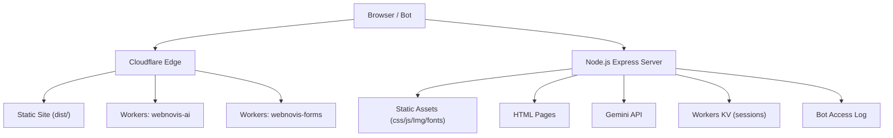
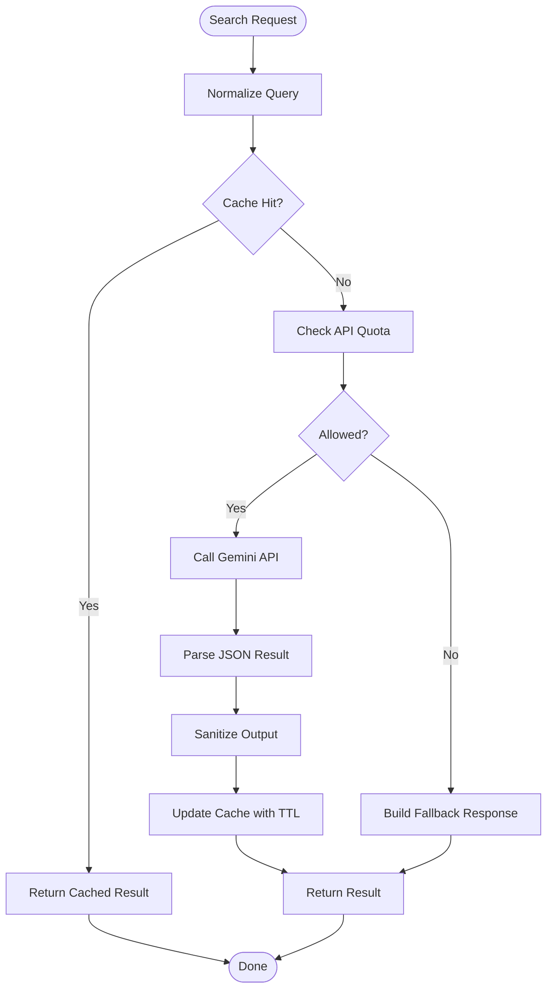

# Troubleshooting & Maintenance

<cite>
**Referenced Files in This Document**
- [server.js](file://server.js)
- [build.js](file://build.js)
- [package.json](file://package.json)
- [wrangler.jsonc](file://wrangler.jsonc)
- [workers/webnovis-ai/wrangler.jsonc](file://workers/webnovis-ai/wrangler.jsonc)
- [workers/webnovis-forms/wrangler.jsonc](file://workers/webnovis-forms/wrangler.jsonc)
- [chat-config.json](file://chat-config.json)
- [ai-config.js](file://ai-config.js)
- [scripts/prepare-public-artifact.js](file://scripts/prepare-public-artifact.js)
- [docs/deploy/CLOUDFLARE-CONFIGURAZIONE-PASSO-PASSO.md](file://docs/deploy/CLOUDFLARE-CONFIGURAZIONE-PASSO-PASSO.md)
- [docs/chatbot/README-CHAT.md](file://docs/chatbot/README-CHAT.md)
- [js/chat.js](file://js/chat.js)
</cite>

## Table of Contents
1. Introduction
2. Project Structure
3. Core Components
4. Architecture Overview
5. Detailed Component Analysis
6. Dependency Analysis
7. Performance Considerations
8. Troubleshooting Guide
9. Conclusion
10. Appendices

## Introduction
This document provides operational guidance for WebNovis: diagnosing and resolving chatbot connectivity issues, API errors, build failures, and deployment problems; debugging frontend and backend components; analyzing logs; performing maintenance (database cleanup, cache management, performance monitoring); executing backups and recovery; planning disaster recovery and data migration; troubleshooting performance and memory leaks; updating dependencies and security patches; and running operational procedures for common tasks and emergencies.

## Project Structure
WebNovis is a Node.js Express server with a static site build pipeline and Cloudflare Workers assets deployment. Key areas:
- Backend server: Express app serving pages, APIs, rate limiting, security headers, bot logging, and AI integrations.
- Build system: Asset minification, HTML transforms, search index generation, sitemap creation, and artifact preparation.
- Workers: AI worker and forms worker configured via Wrangler.
- Configuration: Chat configuration, AI model settings, and environment variables.
- Deployment: Cloudflare Assets with strict allowlist and redirects.



**Diagram sources**
- [server.js:224-526](file://server.js#L224-L526)
- [wrangler.jsonc:22-28](file://wrangler.jsonc#L22-L28)
- [workers/webnovis-ai/wrangler.jsonc:1-26](file://workers/webnovis-ai/wrangler.jsonc#L1-L26)
- [workers/webnovis-forms/wrangler.jsonc:1-20](file://workers/webnovis-forms/wrangler.jsonc#L1-L20)

**Section sources**
- [package.json:6-60](file://package.json#L6-L60)
- [wrangler.jsonc:1-29](file://wrangler.jsonc#L1-L29)

## Core Components
- Express server: Handles routing, security headers, CORS, rate limiting, static file serving, API endpoints, session management, quota tracking, and bot access logging.
- Build pipeline: Discovers and minifies JS/CSS, applies SEO HTML transforms, generates search index and sitemap, validates pages, and prepares the public artifact for deployment.
- Workers: AI worker with observability and KV for sessions; forms worker with Turnstile and Web3Forms integration.
- Configuration: Centralized AI models and parameters; chatbot behavior and company info.

**Section sources**
- [server.js:224-800](file://server.js#L224-L800)
- [build.js:31-113](file://build.js#L31-L113)
- [ai-config.js:1-38](file://ai-config.js#L1-L38)
- [chat-config.json:1-109](file://chat-config.json#L1-L109)
- [workers/webnovis-ai/wrangler.jsonc:1-26](file://workers/webnovis-ai/wrangler.jsonc#L1-L26)
- [workers/webnovis-forms/wrangler.jsonc:1-20](file://workers/webnovis-forms/wrangler.jsonc#L1-L20)

## Architecture Overview
The runtime flow includes:
- Frontend chat UI calling backend APIs for chat and search.
- Backend enforcing rate limits, quotas, and prompt injection guards before calling Gemini.
- Search results cached in-memory with TTL and deduplication to reduce API calls.
- Sessions stored in-memory on the server with periodic cleanup.
- Workers handle AI-specific logic and form submissions with external services.

```mermaid
sequenceDiagram
participant FE as "Frontend"
participant BE as "Express Server"
participant AI as "Gemini API"
participant Cache as "In-Memory Cache"
participant KV as "Workers KV"
FE->>BE : POST /api/search-ai
BE->>Cache : Check cache key
alt Cache hit
Cache-->>BE : Result
BE-->>FE : JSON response
else Cache miss
BE->>AI : generateContent(query, context)
AI-->>BE : JSON result
BE->>Cache : Store result with TTL
BE-->>FE : JSON response
end
Note over BE,KV : Session state managed server-side; KV used by workers for persistence if needed
```

**Diagram sources**
- [server.js:643-800](file://server.js#L643-L800)
- [workers/webnovis-ai/wrangler.jsonc:19-25](file://workers/webnovis-ai/wrangler.jsonc#L19-L25)

## Detailed Component Analysis

### Chatbot Connectivity and API Errors
Symptoms:
- Chat does not open or returns generic responses.
- “Backend unavailable” or empty AI response.
- Quota exceeded warnings or blocks.

Root causes and resolutions:
- Missing or invalid API keys: Ensure GEMINI_API_KEY_CHAT and GEMINI_API_KEY_SEARCH are set in environment. The server uses these keys for chat and search respectively.
- Rate limiting: Chat endpoint enforces per-IP limits; excessive requests will be blocked temporarily.
- Prompt injection guard: Requests matching known injection patterns return safe fallback responses instead of invoking the model.
- Quota tracking: Daily usage counters warn at thresholds and block when daily caps are reached.
- Network timeouts: Search AI calls use timeouts; failures fall back to local results.

Operational checks:
- Verify environment variables for API keys and CORS origins.
- Inspect server logs for quota warnings and errors.
- Confirm CORS origin configuration allows your frontend domain.
- Validate that the frontend points to the correct API endpoint in production.

**Section sources**
- [server.js:180-220](file://server.js#L180-L220)
- [server.js:252-282](file://server.js#L252-L282)
- [server.js:643-800](file://server.js#L643-L800)
- [ai-config.js:1-38](file://ai-config.js#L1-L38)
- [docs/chatbot/README-CHAT.md:148-166](file://docs/chatbot/README-CHAT.md#L148-L166)
- [js/chat.js:560-586](file://js/chat.js#L560-L586)

### Build Failures
Symptoms:
- Minification errors for JS or CSS.
- Public build requires non-zero inputs.
- HTML minification skipped due to missing dependency.

Resolutions:
- Install all dependencies before building.
- Ensure source files exist and are valid; check explicit input lists.
- If Lightning CSS fails, the build falls back to CleanCSS; investigate problematic CSS files.
- For public builds, ensure both JS and CSS inputs are present.

Diagnostics:
- Run the build script and review logs for specific file failures.
- Use the dist-oriented build command to validate the artifact.

**Section sources**
- [build.js:31-113](file://build.js#L31-L113)
- [build.js:286-371](file://build.js#L286-L371)
- [build.js:373-496](file://build.js#L373-L496)
- [package.json:6-60](file://package.json#L6-L60)

### Deployment Issues
Symptoms:
- Headers missing or incorrect in production.
- Source files exposed publicly.
- Redirects not working as expected.
- Workers deploy failures.

Resolutions:
- Configure Cloudflare Transform Rules for security headers and WAF rules to block sensitive paths.
- Use the provided verification script to confirm headers and redirects.
- Ensure Workers configuration matches intended domains and secrets.
- Use dry-run deployments to validate changes before publishing.

Diagnostics:
- Run header verification and redirect checks.
- Inspect Cloudflare dashboard for custom rules and caching policies.
- Validate Workers dev and preview URLs during development.

**Section sources**
- [docs/deploy/CLOUDFLARE-CONFIGURAZIONE-PASSO-PASSO.md:1-241](file://docs/deploy/CLOUDFLARE-CONFIGURAZIONE-PASSO-PASSO.md#L1-L241)
- [wrangler.jsonc:1-29](file://wrangler.jsonc#L1-L29)
- [workers/webnovis-ai/wrangler.jsonc:1-26](file://workers/webnovis-ai/wrangler.jsonc#L1-L26)
- [workers/webnovis-forms/wrangler.jsonc:1-20](file://workers/webnovis-forms/wrangler.jsonc#L1-L20)

### Data Flows and Processing Logic
- Search AI flow: query normalization, cache lookup, optional API call with timeout, result sanitization, and caching with TTL.
- Chat flow: session creation and lifecycle management, prompt injection detection, quota tracking, and safe fallback responses.
- Build flow: asset discovery, minification, SEO transforms, index generation, validation, and artifact promotion.



**Diagram sources**
- [server.js:643-800](file://server.js#L643-L800)

**Section sources**
- [server.js:643-800](file://server.js#L643-L800)

## Dependency Analysis
Key runtime dependencies:
- Express, CORS, compression, rate limiting, Nunjucks, node-fetch.
- Dev dependencies include minifiers, validators, and Wrangler for Workers.

Build-time dependencies:
- Terser for JS minification.
- Lightning CSS with CleanCSS fallback.
- HTML minifier for HTML optimization.

Operational implications:
- Missing dependencies can cause startup failures or degraded functionality (e.g., rate limiting disabled).
- Build failures may occur if minifiers fail or required inputs are absent.

**Section sources**
- [package.json:69-90](file://package.json#L69-L90)
- [build.js:13-27](file://build.js#L13-L27)
- [server.js:95-107](file://server.js#L95-L107)

## Performance Considerations
- Compression middleware reduces transfer sizes for text assets.
- In-memory caches for search results with TTL and size limits prevent unbounded growth.
- Session cleanup runs periodically to free memory.
- Static assets served with appropriate cache headers; versioned assets benefit from long-lived CDN caching.
- Quota tracking prevents runaway API costs and protects availability.

Recommendations:
- Monitor cache hit rates and adjust TTL based on traffic patterns.
- Review session eviction policies under high load.
- Use Workers Observability to track latency and error rates for AI operations.
- Regularly audit unused assets to minimize payload size.

[No sources needed since this section provides general guidance]

## Troubleshooting Guide

### Chatbot Connectivity Problems
- Symptoms: Chat not opening, generic responses, empty AI response.
- Checks:
  - Verify API keys in environment.
  - Confirm CORS origins allow your frontend domain.
  - Inspect browser console for network errors.
  - Review server logs for quota warnings and injection detections.
- Actions:
  - Adjust rate limits if legitimate users are blocked.
  - Update CSP and WAF rules if external scripts are blocked.
  - Ensure frontend points to the correct production API endpoint.

**Section sources**
- [server.js:252-282](file://server.js#L252-L282)
- [server.js:643-800](file://server.js#L643-L800)
- [docs/chatbot/README-CHAT.md:148-166](file://docs/chatbot/README-CHAT.md#L148-L166)
- [js/chat.js:560-586](file://js/chat.js#L560-L586)

### API Errors
- Symptoms: 4xx/5xx responses, quota exceeded, empty responses.
- Checks:
  - Validate request payloads and sanitize inputs.
  - Inspect quota counters and daily caps.
  - Confirm network connectivity and timeouts.
- Actions:
  - Increase rate limit windows cautiously if needed.
  - Implement retry logic with exponential backoff for transient errors.
  - Add structured logging for API calls and responses.

**Section sources**
- [server.js:180-220](file://server.js#L180-L220)
- [server.js:643-800](file://server.js#L643-L800)

### Build Failures
- Symptoms: Minification errors, missing inputs, skipped steps.
- Checks:
  - Ensure dependencies installed.
  - Validate source files and explicit input lists.
  - Review build logs for specific failures.
- Actions:
  - Fix CSS/JS syntax issues causing minification failures.
  - Provide required inputs for public builds.
  - Re-run build with verbose output to pinpoint errors.

**Section sources**
- [build.js:31-113](file://build.js#L31-L113)
- [build.js:373-496](file://build.js#L373-L496)
- [package.json:6-60](file://package.json#L6-L60)

### Deployment Issues
- Symptoms: Incorrect headers, exposed sources, broken redirects, Workers deploy failures.
- Checks:
  - Verify Cloudflare Transform Rules and WAF configurations.
  - Run header verification and redirect checks.
  - Validate Workers configuration and secrets.
- Actions:
  - Update CSP and WAF rules to match application needs.
  - Use dry-run deployments to test changes.
  - Ensure only public artifacts are published.

**Section sources**
- [docs/deploy/CLOUDFLARE-CONFIGURAZIONE-PASSO-PASSO.md:1-241](file://docs/deploy/CLOUDFLARE-CONFIGURAZIONE-PASSO-PASSO.md#L1-L241)
- [wrangler.jsonc:1-29](file://wrangler.jsonc#L1-L29)
- [workers/webnovis-ai/wrangler.jsonc:1-26](file://workers/webnovis-ai/wrangler.jsonc#L1-L26)
- [workers/webnovis-forms/wrangler.jsonc:1-20](file://workers/webnovis-forms/wrangler.jsonc#L1-L20)

### Debugging Techniques
- Frontend:
  - Open browser developer tools to inspect network requests and console errors.
  - Verify API endpoint configuration for production.
- Backend:
  - Review server logs for errors, quota warnings, and bot access logs.
  - Use structured logging for API calls and responses.
- Workers:
  - Enable observability and tail logs during development.
  - Validate KV namespaces and secrets.

**Section sources**
- [server.js:395-429](file://server.js#L395-L429)
- [workers/webnovis-ai/wrangler.jsonc:11-14](file://workers/webnovis-ai/wrangler.jsonc#L11-L14)
- [docs/chatbot/README-CHAT.md:148-166](file://docs/chatbot/README-CHAT.md#L148-L166)

### Log Analysis and Error Tracking
- Bot access log: Tracks crawler activity for GEO strategy insights.
- Server logs: Capture API errors, quota warnings, and lead capture events.
- Workers logs: Use observability to monitor AI worker performance and errors.

Actions:
- Rotate logs regularly to avoid disk pressure.
- Aggregate logs centrally for analysis and alerting.
- Set up alerts for critical errors and quota thresholds.

**Section sources**
- [server.js:395-429](file://server.js#L395-L429)
- [server.js:944-1021](file://server.js#L944-L1021)
- [workers/webnovis-ai/wrangler.jsonc:11-14](file://workers/webnovis-ai/wrangler.jsonc#L11-L14)

### Maintenance Procedures
- Database cleanup: Not applicable (no database), but manage in-memory sessions and caches.
- Cache management:
  - Monitor in-memory cache size and TTL effectiveness.
  - Prune expired sessions periodically.
- Performance monitoring:
  - Use Workers Observability for AI worker metrics.
  - Track API quota usage and adjust thresholds as needed.

**Section sources**
- [server.js:584-619](file://server.js#L584-L619)
- [server.js:643-668](file://server.js#L643-L668)
- [workers/webnovis-ai/wrangler.jsonc:11-14](file://workers/webnovis-ai/wrangler.jsonc#L11-L14)

### Backup and Recovery
- Artifact backup: The artifact preparation script backs up previous dist before promotion.
- Configuration backup: Keep versions of chat-config.json and ai-config.js in version control.
- Recovery: Restore previous artifact if promotion fails; re-deploy using Wrangler.

**Section sources**
- [scripts/prepare-public-artifact.js:158-181](file://scripts/prepare-public-artifact.js#L158-L181)
- [wrangler.jsonc:1-29](file://wrangler.jsonc#L1-L29)

### Disaster Recovery Planning
- Define RTO/RPO for site availability and data loss.
- Maintain runbooks for restoring artifacts and reconfiguring Cloudflare rules.
- Test recovery procedures regularly to ensure readiness.

[No sources needed since this section provides general guidance]

### Data Migration Processes
- Migrate configuration changes through version-controlled files.
- Validate migrations with dry-run builds and tests.
- Rollback plan: revert configuration and redeploy previous artifact.

**Section sources**
- [scripts/prepare-public-artifact.js:205-249](file://scripts/prepare-public-artifact.js#L205-L249)
- [build.js:373-496](file://build.js#L373-L496)

### Performance Troubleshooting
- Identify slow API calls and optimize prompts or caching strategies.
- Reduce payload sizes by pruning unused assets.
- Tune cache TTLs based on content update frequency.

[No sources needed since this section provides general guidance]

### Memory Leak Detection
- Monitor session map size and eviction policies.
- Profile Node.js heap usage under load.
- Investigate long-lived objects and clear references appropriately.

**Section sources**
- [server.js:584-619](file://server.js#L584-L619)

### Resource Utilization Monitoring
- Use Workers Observability to track CPU, memory, and network usage.
- Monitor server resource consumption and scale horizontally if needed.
- Set alerts for resource exhaustion and quota thresholds.

**Section sources**
- [workers/webnovis-ai/wrangler.jsonc:11-14](file://workers/webnovis-ai/wrangler.jsonc#L11-L14)

### Updating Dependencies and Security Patches
- Regularly audit dependencies for vulnerabilities.
- Apply patches and test builds thoroughly before deployment.
- Use CI pipelines to enforce quality gates and security checks.

**Section sources**
- [package.json:69-90](file://package.json#L69-L90)
- [docs/deploy/CLOUDFLARE-CONFIGURAZIONE-PASSO-PASSO.md:1-241](file://docs/deploy/CLOUDFLARE-CONFIGURAZIONE-PASSO-PASSO.md#L1-L241)

### Operational Runbooks
- Common tasks:
  - Restart server process and verify health endpoints.
  - Clear in-memory caches and sessions if necessary.
  - Rebuild and redeploy artifacts after configuration changes.
- Emergency procedures:
  - Roll back to previous artifact if deployment fails.
  - Temporarily disable AI features by adjusting configuration.
  - Block abusive IPs using WAF rules.

**Section sources**
- [scripts/prepare-public-artifact.js:158-181](file://scripts/prepare-public-artifact.js#L158-L181)
- [server.js:584-619](file://server.js#L584-L619)
- [docs/deploy/CLOUDFLARE-CONFIGURAZIONE-PASSO-PASSO.md:104-159](file://docs/deploy/CLOUDFLARE-CONFIGURAZIONE-PASSO-PASSO.md#L104-L159)

## Conclusion
WebNovis combines a robust Express server, a comprehensive build pipeline, and Cloudflare Workers to deliver a secure, performant, and maintainable website with integrated AI capabilities. By following the troubleshooting and maintenance procedures outlined here, teams can quickly diagnose and resolve issues, ensure system reliability, and keep the platform optimized for user experience and business goals.

[No sources needed since this section summarizes without analyzing specific files]

## Appendices

### Diagnostic Commands
- Verify production headers and redirects:
  - npm run verify:prod-headers
- Build and prepare public artifact:
  - npm run build:site:dist
- Deploy Workers:
  - npm run deploy:site
- Tail Workers logs:
  - npm run ai:tail

**Section sources**
- [package.json:45-58](file://package.json#L45-L58)
- [docs/deploy/CLOUDFLARE-CONFIGURAZIONE-PASSO-PASSO.md:233-241](file://docs/deploy/CLOUDFLARE-CONFIGURAZIONE-PASSO-PASSO.md#L233-L241)